

### **Universidad Peruana de Ciencias Aplicadas**
#### **Carrera de Ingeniería de Software**

 

### **1ACC0238**
## **Aplicaciones para Dispositivos Móviles**

 

**NRC**
### **4948**
  
 

## **Informe del Trabajo Final**

 

**Docente**
### **Eduardo Martin Reyes Rodriguez**

 

**Equipo**
### **PredictiveTech**

**Proyecto**
### **PredictiveMaintain**

 

### **Integrantes**

|     Código     | Apellidos y Nombres            |
|:--------------:|:-------------------------------|
| **u202317450** | Choy Robles, Vanessa May Lang  |
|   **CODIGO**   | NOMBRE CAMBIAR                 |
|   **CODIGO**   | NOMBRE CAMBIAR                 |
| **u201916755** | Aiquipa Poma, Sebastian Andres |

 

### **Período 202610**
### **Setiembre 2026**

---

# Registro de Versiones del Informe  
---

| Versión | Fecha | Autor(es) | Descripción de modificación |
|:-------:|:-----:|:---------|:---------------------------|
| **V1.0** | 2026-09-18 | Todos | Entrega del avance 1 |

 

# Project Report Collaboration Insights  

## Evidencia de colaboración en GitHub

---

# Contenido

- [Registro de Versiones del Informe](#registro-de-versiones-del-informe)
- [Project Report Collaboration Insights](#project-report-collaboration-insights)
- [Contenido](#contenido)
- [Student Outcome](#student-outcome)
- [Objetivos SMART](#objetivos-smart)
- [Capítulo I: Presentación](#capítulo-i-presentación)
  - [1.1. Startup Profile](#11-startup-profile)
    - [1.1.1. Descripción de la Startup](#111-descripción-de-la-startup)
    - [1.1.2. Perfiles de integrantes del equipo](#112-perfiles-de-integrantes-del-equipo)
  - [1.2. Solution Profile](#12-solution-profile)
    - [1.2.1. Antecedentes y problemática](#121-antecedentes-y-problemática)
    - [1.2.2. Lean UX Process](#122-lean-ux-process)
      - [1.2.2.1. Lean UX Problem Statements](#1221-lean-ux-problem-statements)
      - [1.2.2.2. Lean UX Assumptions](#1222-lean-ux-assumptions)
      - [1.2.2.3. Lean UX Hypothesis Statements](#1223-lean-ux-hypothesis-statements)
      - [1.2.2.4. Lean UX Canvas](#1224-lean-ux-canvas)
  - [1.3. Segmentos objetivo](#13-segmentos-objetivo)
- [Capítulo II: Requirements Development and Software Solution Design](#capítulo-ii-requirements-development-and-software-solution-design)
  - [2.1. Competidores](#21-competidores)
    - [2.1.1. Análisis competitivo](#211-análisis-competitivo)
    - [2.1.2. Estrategias y tácticas frente a competidores](#212-estrategias-y-tácticas-frente-a-competidores)
  - [2.2. Entrevistas](#22-entrevistas)
    - [2.2.1. Diseño de entrevistas](#221-diseño-de-entrevistas)
    - [2.2.2. Registro de entrevistas](#222-registro-de-entrevistas)
    - [2.2.3. Análisis de entrevistas](#223-análisis-de-entrevistas)
  - [2.3. Needfinding](#23-needfinding)
    - [2.3.1. User Personas](#231-user-personas)
    - [2.3.2. User Task Matrix](#232-user-task-matrix)
    - [2.3.3. User Journey Mapping](#233-user-journey-mapping)
    - [2.3.4. Empathy Mapping](#234-empathy-mapping)
    - [2.3.5. Big Picture EventStorming](#235-big-picture-eventstorming)
    - [2.3.6. Ubiquitous Language](#236-ubiquitous-language)
  - [2.4. Requirements specification](#24-requirements-specification)
    - [2.4.1. User Stories](#241-user-stories)
    - [2.4.2. Impact Mapping](#242-impact-mapping)
    - [2.4.3. Product Backlog](#243-product-backlog)
  - [2.5. Strategic-Level Domain-Driven Design](#25-strategic-level-domain-driven-design)
    - [2.5.1. EventStorming](#251-eventstorming)
      - [2.5.1.1. Candidate Context Discovery](#2511-candidate-context-discovery)
      - [2.5.1.2. Domain Message Flows Modeling](#2512-domain-message-flows-modeling)
      - [2.5.1.3. Bounded Context Canvases](#2513-bounded-context-canvases)
    - [2.5.2. Context Mapping](#252-context-mapping)
    - [2.5.3. Software Architecture](#253-software-architecture)
      - [2.5.3.1. Software Architecture Context Level Diagrams](#2531-software-architecture-context-level-diagrams)
      - [2.5.3.2. Software Architecture Container Level Diagrams](#2532-software-architecture-container-level-diagrams)
      - [2.5.3.3. Software Architecture Deployment Diagrams](#2533-software-architecture-deployment-diagrams)
  - [2.6. Tactical-Level Domain-Driven Design](#26-tactical-level-domain-driven-design)
    - [2.6.1. Bounded Context: Asset Telemetry & Analytics](#261-bounded-context-asset-telemetry--analytics)
      - [2.6.1.1. Domain Layer](#2611-domain-layer)
      - [2.6.1.2. Interface Layer](#2612-interface-layer)
      - [2.6.1.3. Application Layer](#2613-application-layer)
      - [2.6.1.4. Infrastructure Layer](#2614-infrastructure-layer)
      - [2.6.1.5. Bounded Context Software Architecture Component Level Diagrams](#2615-bounded-context-software-architecture-component-level-diagrams)
      - [2.6.1.6. Bounded Context Software Architecture Code Level Diagrams](#2616-bounded-context-software-architecture-code-level-diagrams)
        - [2.6.1.6.1. Bounded Context Domain Layer Class Diagrams](#26161-bounded-context-domain-layer-class-diagrams)
        - [2.6.1.6.2. Bounded Context Database Design Diagram](#26162-bounded-context-database-design-diagram)
    - [2.6.2. Bounded Context: Maintenance Operations](#262-bounded-context-maintenance-operations)
      - [2.6.2.1. Domain Layer](#2621-domain-layer)
      - [2.6.2.2. Interface Layer](#2622-interface-layer)
      - [2.6.2.3. Application Layer](#2623-application-layer)
      - [2.6.2.4. Infrastructure Layer](#2624-infrastructure-layer)
      - [2.6.2.5. Bounded Context Software Architecture Component Level Diagrams](#2625-bounded-context-software-architecture-component-level-diagrams)
      - [2.6.2.6. Bounded Context Software Architecture Code Level Diagrams](#2626-bounded-context-software-architecture-code-level-diagrams)
        - [2.6.2.6.1. Bounded Context Domain Layer Class Diagrams](#26261-bounded-context-domain-layer-class-diagrams)
        - [2.6.2.6.2. Bounded Context Database Design Diagram](#26262-bounded-context-database-design-diagram)
    - [2.6.3. Bounded Context: Subscription & Billing](#263-bounded-context-subscription--billing)
      - [2.6.3.1. Domain Layer](#2631-domain-layer)
      - [2.6.3.2. Interface Layer](#2632-interface-layer)
      - [2.6.3.3. Application Layer](#2633-application-layer)
      - [2.6.3.4. Infrastructure Layer](#2634-infrastructure-layer)
      - [2.6.3.5. Bounded Context Software Architecture Component Level Diagrams](#2635-bounded-context-software-architecture-component-level-diagrams)
      - [2.6.3.6. Bounded Context Software Architecture Code Level Diagrams](#2636-bounded-context-software-architecture-code-level-diagrams)
        - [2.6.3.6.1. Bounded Context Domain Layer Class Diagrams](#26361-bounded-context-domain-layer-class-diagrams)
        - [2.6.3.6.2. Bounded Context Database Design Diagram](#26362-bounded-context-database-design-diagram)
    - [2.6.4. Bounded Context: Identity & Access Management](#264-bounded-context-identity--access-management)
      - [2.6.4.1. Domain Layer](#2641-domain-layer)
      - [2.6.4.2. Interface Layer](#2642-interface-layer)
      - [2.6.4.3. Application Layer](#2643-application-layer)
      - [2.6.4.4. Infrastructure Layer](#2644-infrastructure-layer)
      - [2.6.4.5. Bounded Context Software Architecture Component Level Diagrams](#2645-bounded-context-software-architecture-component-level-diagrams)
      - [2.6.4.6. Bounded Context Software Architecture Code Level Diagrams](#2646-bounded-context-software-architecture-code-level-diagrams)
        - [2.6.4.6.1. Bounded Context Domain Layer Class Diagrams](#26461-bounded-context-domain-layer-class-diagrams)
        - [2.6.4.6.2. Bounded Context Database Design Diagram](#26462-bounded-context-database-design-diagram)
- [Capítulo III: Solution UI/UX Design](#capítulo-iii-solution-uiux-design)
  - [3.1. Product design](#31-product-design)
    - [3.1.1. Style Guidelines](#311-style-guidelines)
      - [3.1.1.1. General Style Guidelines](#3111-general-style-guidelines)
    - [3.1.2. Information Architecture](#312-information-architecture)
      - [3.1.2.1. Organization Systems](#3121-organization-systems)
      - [3.1.2.2. Labelling Systems](#3122-labelling-systems)
      - [3.1.2.3. SEO Tags and Meta Tags](#3123-seo-tags-and-meta-tags)
      - [3.1.2.4. Searching Systems](#3124-searching-systems)
      - [3.1.2.5. Navigation Systems](#3125-navigation-systems)
    - [3.1.3. Landing Page UI Design](#313-landing-page-ui-design)
      - [3.1.3.1. Landing Page Wireframe](#3131-landing-page-wireframe)
      - [3.1.3.2. Landing Page Mock-up](#3132-landing-page-mock-up)
    - [3.1.4. Mobile Applications UX/UI Design](#314-mobile-applications-uxui-design)
      - [3.1.4.1. Mobile Applications Wireframes](#3141-mobile-applications-wireframes)
      - [3.1.4.2. Mobile Applications Wireflow Diagrams](#3142-mobile-applications-wireflow-diagrams)
      - [3.1.4.3. Mobile Applications Mock-ups](#3143-mobile-applications-mock-ups)
      - [3.1.4.4. Mobile Applications User Flow Diagrams](#3144-mobile-applications-user-flow-diagrams)
      - [3.1.4.5. Mobile Applications Prototyping](#3145-mobile-applications-prototyping)
- [Capítulo IV: Product Implementation & Validation](#capítulo-iv-product-implementation--validation)
  - [4.1. Software Configuration Management](#41-software-configuration-management)
    - [4.1.1. Software Development Environment Configuration](#411-software-development-environment-configuration)
    - [4.1.2. Source Code Management](#412-source-code-management)
    - [4.1.3. Source Code Style Guide & Conventions](#413-source-code-style-guide--conventions)
    - [4.1.4. Software Deployment Configuration](#414-software-deployment-configuration)
  - [4.2. Landing Page & Mobile Application Implementation](#42-landing-page--mobile-application-implementation)
    - [4.2.1. Sprint n](#421-sprint-n)
      - [4.2.1.1. Sprint Planning n](#4211-sprint-planning-n)
      - [4.2.1.2. Aspect Leaders and Collaborators](#4212-aspect-leaders-and-collaborators)
      - [4.2.1.3. Sprint Backlog n](#4213-sprint-backlog-n)
      - [4.2.1.4. Development Evidence for Sprint Review](#4214-development-evidence-for-sprint-review)
      - [4.2.1.5. Testing Suite Evidence for Sprint Review](#4215-testing-suite-evidence-for-sprint-review)
      - [4.2.1.6. Execution Evidence for Sprint Review](#4216-execution-evidence-for-sprint-review)
      - [4.2.1.7. Services Documentation Evidence for Sprint Review](#4217-services-documentation-evidence-for-sprint-review)
      - [4.2.1.8. Software Deployment Evidence for Sprint Review](#4218-software-deployment-evidence-for-sprint-review)
      - [4.2.1.9. Team Collaboration Insights during Sprint](#4219-team-collaboration-insights-during-sprint)
  - [4.3. Validation Interviews](#43-validation-interviews)
    - [4.3.1. Diseño de Entrevistas](#431-diseño-de-entrevistas)
    - [4.3.2. Registro de Entrevistas](#432-registro-de-entrevistas)
    - [4.3.3. Evaluaciones según heurísticas](#433-evaluaciones-según-heurísticas)
- [Conclusiones](#conclusiones)
- [Conclusiones y recomendaciones](#conclusiones-y-recomendaciones)
- [Video App Validation](#video-app-validation)
- [Video About the product](#video-about-the-product)
- [Video About the team](#video-about-the-team)
- [Glosario](#glosario)
- [Bibliografía](#bibliografía)
- [Anexos](#anexos)

---

# Student Outcome

El curso contribuye al cumplimiento del Student Outcome ABET:

**ABET - EAC - Student Outcome 7**
Criterio: La capacidad de adquirir y aplicar nuevos conocimientos según sea necesario, utilizando estrategias de aprendizaje apropiadas.

En el siguiente cuadro se describe las acciones realizadas y enunciados de conclusiones por parte del grupo, que permiten sustentar el haber alcanzado el logro del ABET – EAC - Student Outcome 7.

| Criterio Específico | Acciones realizadas                                                                                                                                                                                                                                                                                                                                                                                                                                                                                                                                                                                                                                     | Conclusiones |
|---|---------------------------------------------------------------------------------------------------------------------------------------------------------------------------------------------------------------------------------------------------------------------------------------------------------------------------------------------------------------------------------------------------------------------------------------------------------------------------------------------------------------------------------------------------------------------------------------------------------------------------------------------------------|---|
| Actualiza conceptos y conocimientos necesarios para su desarrollo profesional y en especial para su proyecto en soluciones de software. | **Aiquipa Poma, Sebastian Andres** **AV1:** Elaboró los artefactos de Needfinding (User Personas, User Task Matrix, User Journey Maps y Empathy Maps) en UXPressia, modeló el dominio mediante Big Picture EventStorming, y desarrolló la sección de Requirements Specification redactando User Stories, Technical Stories y Spike Stories con criterios de aceptación, Impact Mapping con Business Goals y Product Backlog.  **Apellido, Nombre 2** **AV1:** **TB1:**  **Apellido, Nombre 3** **AV1:** **TB1:**  **Apellido, Nombre 4** **AV1:** **TB1:**  **Apellido, Nombre 5** **AV1:** **TB1:** | **AV1**  **TB1** |
| Reconoce la necesidad del aprendizaje permanente para el desempeño profesional y el desarrollo de proyectos en soluciones de software. | **Aiquipa Poma, Sebastian Andres** **AV1:** Durante el desarrollo de Requirements Specification identificó la necesidad de investigar de forma autónoma conceptos como la estimación de Vida Útil Restante (RUL), la metodología de Big Picture EventStorming y las convenciones de Spike Stories, integrándolos al proyecto para producir artefactos más precisos y alineados con las necesidades reales del negocio identificadas en las entrevistas.  **Apellido, Nombre 2** **AV1:** **TB1:**  **Apellido, Nombre 3** **AV1:** **TB1:**  **Apellido, Nombre 4** **AV1:** **TB1:**  **Apellido, Nombre 5** **AV1:** **TB1:**                                                                                                                                                                                                                                                                                                                                                                     | **AV1**  **TB1** |

# Objetivos SMART

# Capítulo I: Presentación

## 1.1. Startup Profile

### 1.1.1. Descripción de la Startup

PredictiveTech ofrece una solución tecnológica especializada con el aplicativo "PredictiveMaintain", enfocada en la monitorización y mantenimiento predictivo de maquinaria industrial pesada y de manufactura. Mediante el análisis continuo de variables físicas recolectadas (vibración, temperatura, nivel de ruido, presión y amperaje), la plataforma procesa patrones anómalos para diagnosticar fallas antes de que provoquen detenciones no programadas en la línea de producción.

Nuestra propuesta se basa en un modelo con suscripciones escalables según el volumen de activos conectados. El objetivo central de PredictiveTech es reducir los costos operativos por paradas intempestivas, extender la vida útil de los equipos industriales y optimizar la asignación de personal técnico mediante órdenes de trabajo automatizadas y guiadas por analítica predictiva.

Misión: Proporcionar una plataforma integral de analítica predictiva que maximice la disponibilidad operativa de las plantas industriales, reduciendo costos de mantenimiento reactivo y mejorando la seguridad laboral.

Visión: Convertirnos en el software de gestión predictiva industrial preferido en la región, impulsando la transformación hacia la Industria a través de interfaces intuitivas y modelos predictivos.

### 1.1.2. Perfiles de integrantes del equipo

    

- Choy Robles, Vanessa May Lang - u202317450 (Ingeniería de Software)

Soy estudiante de Ingeniería de Software con experiencia en distintos lenguajes de programación, diseño UX/UI y trabajo bajo metodologías ágiles como Scrum. Aporto al equipo una visión orientada tanto a la funcionalidad como a la experiencia del usuario, contribuyendo en el desarrollo y mejora continua del producto. Me caracterizo por mi responsabilidad, cumplimiento de plazos y participación activa en el trabajo colaborativo. 

    

- XXX

  

    

- Sebastian Andres Aiquipa Poma - u201916755 (Ingenieria de Software)

Estudiante de Ingeniería de Software y desarrollador full-stack. Tengo experiencia construyendo plataformas web completas desde la arquitectura hasta el despliegue utilizando tecnologías como React, Node.js, Express y PostgreSQL. Actualmente, mi objetivo es seguir consolidando mis habilidades técnicas para desempeñarme con confianza en el entorno laboral. Me interesa participar en proyectos donde pueda aplicar lo que sé y aportar soluciones prácticas a problemas reales.

    

- Valverde Portuguez, Natalia Ximena - u20231a816 (Ingeniería de Software)

Estudiante de Ingeniería de Software en la Universidad Peruana de Ciencias Aplicadas (UPC). Cuento con conocimientos de Marketing y estoy interesada en el UX Design y data analysis. Experiencia en trabajos de creación de startups en el ámbito laboral, lo que fortalece mis capacidades tanto en trabajos grupales e individuales como para las bases de un proyecto.

## 1.2. Solution Profile

### 1.2.1. Antecedentes y problemática
En el sector industrial y manufacturero peruano, la continuidad operativa es un factor crítico para la competitividad económica. No obstante, la gestión del mantenimiento de maquinaria sigue estando dominada por enfoques reactivos (reparación tras la avería) y preventivos tradicionales (mantenimiento por calendario o kilometraje fijo). Según datos reportados por la Sociedad Nacional de Industrias (SNI) y estudios de la consultora McKinsey, el tiempo de inactividad no planificado cuesta a los fabricantes industriales a nivel mundial un estimado de $50,000 millones de dólares anuales, donde la falla imprevista de componentes electromecánicos representa hasta el 42% de estas paradas no programadas.

A nivel nacional, informes del Instituto Nacional de Estadística e Informática (INEI) sobre el sector manufacturero e hidrocarburos indican que los costos operativos vinculados al mantenimiento no planificado e importación de repuestos de emergencia absorbían entre un 25% y 35% de los presupuestos de producción en plantas medianas y grandes. La falta de digitalización en el monitoreo de condición impide que las empresas anticipen patrones de desgaste en activos críticos (motores, bombas centrífugas, fajas transportadoras y compresores), desencadenando paradas catastróficas que afectan directamente las metas de producción y aumentan la tasa de accidentes laborales durante reparaciones de emergencia.

**What**

El problema central es la incapacidad de detectar y predecir fallas mecánicas e hidráulicas incipientes en maquinaria industrial crítica, debido a la dependencia de inspecciones manuales periódicas y a la ausencia de herramientas integradas de analítica predictiva e Internet de las Cosas.

**When**

El problema se manifiesta de forma continua durante los turnos de producción intensiva, agudizándose cuando los activos operan bajo condiciones de sobrecarga térmica o vibracional, generando fallas intempestivas sin previo aviso.

**Where**

Ocurre en las plantas de procesamiento industrial, fábricas manufactureras, operaciones mineras y centros logísticos automatizados ubicados principalmente en los corredores industriales de Lima Metropolitana, Callao y principales regiones agroindustriales del Perú.

**Who**

Afecta principalmente a dos grupos dentro de la planta: al Área de Mantenimiento y Gestión Operativa (Jefes de Mantenimiento e Ingenieros), quienes deben asumir sobrecostos de reparación y el incumplimiento de las cuotas de producción; y a los Operadores de Maquinaria y Planta, quienes enfrentan interrupciones en su flujo operativo y condiciones de riesgo al trabajar con equipos en estado crítico de falla.

**Why**

Esta problemática ocurre por la escasa adopción de arquitecturas IoT en la Industria 4.0 a nivel local, los elevados costos percibidos para la implementación de sistemas CMMS/SCADA tradicionales y la falta de plataformas unificadas capaces de transformar lecturas de sensores en alertas predictivas comprensibles.

**How**

Actualmente, el proceso de diagnóstico depende de la inspección auditiva/visual de los técnicos, rondas de medición manual discontinuas con equipos portátiles y bitácoras en papel o hojas de cálculo (Excel), lo que resulta en análisis extemporáneos y toma de decisiones reactivas.

**How much**

El impacto financiero y operativo es sumamente elevado: las paradas de línea no planificadas reducen la Eficiencia General de los Equipos (OEE) de las plantas hasta en un 20%, incrementan los costos de mantenimiento correctivo en un 40% frente al costo de una reparación planificada, y recortan la vida útil de los activos industriales en un 15% a 25% debido al reemplazo tardío de piezas defectuosas.

### 1.2.2. Lean UX Process

#### 1.2.2.1. Lean UX Problem Statements

Actualmente, en las plantas industriales de Lima Metropolitana y principales zonas del país, los equipos responsables del Mantenimiento y la Operación de maquinaria enfrentan serias dificultades para prevenir fallas mecánicas e hidráulicas imprevistas en sus activos críticos. La mayoría de procesos de supervisión se realiza de forma manual mediante rondas de inspección discontinuas o mantenimiento preventivo rígido por calendario, lo que genera paradas de planta no programadas, sobrecostos operativos por reparaciones de emergencia y riesgos en la seguridad industrial.

Asimismo, los operadores y el personal de mantenimiento carecen de una herramienta digital centralizada que integre telemetría IoT en tiempo real y analítica predictiva para identificar anomalías operativas de forma anticipada y diagnosticar componentes defectuosos con precisión.

Hemos observado que no existe una herramienta digital SaaS especializada que conecte de forma segura y directa los sensores IoT de la maquinaria con un tablero de control para predecir anomalías, estimar la vida útil restante (RUL) de los activos y automatizar la asignación de órdenes de trabajo.

¿Cómo podríamos facilitar que los equipos de planta detecten y anticipen fallas en maquinaria industrial de manera rápida, precisa y centralizada, al mismo tiempo que reducen las paradas no programadas y optimizan los costos de mantenimiento?

**¿QUIÉN ES EL USUARIO?**

Nuestros usuarios pertenecen a dos grupos clave dentro de la planta: el Área de Mantenimiento y Gestión Operativa (Jefes e Ingenieros de Mantenimiento que planifican y toman decisiones sobre los activos) y los Operadores de Maquinaria y Planta (técnicos a pie de planta que interactúan directamente con los equipos y ejecutan las labores operativas).

**¿DÓNDE ENCAJA NUESTRO PRODUCTO EN SU VIDA?**

El producto se integra en la rutina diaria de la planta como un centro de control digital (dashboard) y sistema de alertas en tiempo real. Es utilizado tanto para el monitoreo continuo de la salud de los activos durante los turnos de trabajo como para la programación anticipada de reparaciones y la asignación eficiente de órdenes de trabajo.

**¿QUÉ PROBLEMAS TIENE NUESTRO PRODUCTO Y CÓMO SE PUEDE RESOLVER?**

Los usuarios enfrentan paradas intempestivas de línea, diagnósticos tardíos por inspecciones manuales y falta de trazabilidad en el desgaste de las máquinas.

Para resolverlo, la plataforma permitirá monitorear variables de telemetría (vibración, temperatura, presión), aplicar filtros de búsqueda por activo o línea de producción, visualizar alertas predictivas de falla (detección de anomalías y RUL), y gestionar órdenes de trabajo automáticas con el perfil técnico adecuado.

**¿CUÁNDO Y CÓMO ES USADO NUESTRO PRODUCTO?**

La plataforma se utiliza de manera continua durante los turnos de producción para vigilar el comportamiento de los sensores IoT en tiempo real, y de manera planificada cuando los gestores de mantenimiento requieren agendar intervenciones, asignar recursos o revisar historiales de falla para la toma de decisiones estratégicas.

**¿QUÉ CARACTERÍSTICAS SON IMPORTANTES?**

- Visualización de telemetría IoT en tiempo real
- Algoritmos de detección de anomalías y cálculo de Vida Útil Restante (RUL)
- Sistema de alertas configurables multicanal por rebasamiento de umbrales
- Catálogo y ficha técnica centralizada de activos industriales
- Generación y asignación automatizada de Órdenes de Trabajo (OT)
- Módulo de reportes de disponibilidad y Eficiencia General de los Equipos (OEE)

**¿CÓMO DEBE VERSE Y COMPORTARSE EL PRODUCTO?**

El producto debe ser intuitivo, claro y con un alto nivel de precisión técnica. Visualmente debe transmitir profesionalismo industrial y utilizar códigos cromáticos de alerta de fácil interpretación rápida (normal, advertencia, crítico). Su comportamiento debe ser fluido, rápido y enfocado en minimizar el tiempo de respuesta ante eventos anómalos.

#### 1.2.2.2. Lean UX Assumptions

**Business Assumptions**

- Creemos que las paradas no programadas de maquinaria crítica son un problema muy frecuente y costoso en las plantas industriales del Perú.

- Creemos que las empresas industriales estarán dispuestas a pagar una suscripción SaaS por una solución que reduzca los costos de mantenimiento reactivo.

- Creemos que existe una demanda creciente por herramientas de digitalización e Industria 4.0 en el sector manufacturero y minero.

- Creemos que la automatización de alertas y órdenes de trabajo mejorará las condiciones de seguridad laboral y la eficiencia operativa en planta.

**Business Outcomes**

- Creemos que al implementar una plataforma de monitoreo IoT y analítica predictiva, podremos reducir el tiempo de inactividad no planificado en un 30%.

- Creemos que al incorporar alertas predictivas y diagnósticos tempranos, incrementaremos la confianza de los gerentes de planta en un 40%.

- Creemos que al automatizar la emisión de órdenes de trabajo, reducaremos el tiempo de atención de fallas en un 35%.

- Creemos que al ofrecer información precisa del estado del activo, aumentaremos la Eficiencia General de los Equipos (OEE) en las plantas en un 20%.

**User Assumptions**

- Creemos que los jefes de mantenimiento necesitan una forma centralizada y precisa de supervisar el estado de toda la maquinaria de la planta.

- Creemos que los operadores de maquinaria valoran recibir alertas claras sobre el estado del equipo para trabajar con seguridad.

- Creemos que el personal técnico busca reducir el tiempo perdido en inspecciones manuales o diagnósticos ambiguos.

- Creemos que los usuarios prefieren soluciones digitales con paneles de control visuales e intuitivos.

- Creemos que la posibilidad de revisar el historial de telemetría e indicadores RUL influye positivamente en la planificación de paradas de planta.

**User Outcomes**

- Creemos que al ofrecer filtros por activo y tipo de sensor, los usuarios podrán diagnosticar problemas de forma más rápida y eficiente.

- Creemos que al implementar perfiles técnicos e historial de equipos, los gestores se sentirán más seguros al asignar las órdenes de trabajo.

- Creemos que al incluir un módulo de reportes analíticos, los responsables de área podrán tomar decisiones de reemplazo con datos sustentados.

- Creemos que al enviar alertas en tiempo real, los operadores podrán pausar o ajustar la carga del equipo antes de una falla grave.

- Creemos que al permitir la gestión del calendario de mantenimiento, el área de mantenimiento podrá organizar mejor las tareas y recursos.

**Feature Assumptions**

- Creemos que un sistema de monitoreo en tiempo real con alertas basadas en umbrales mejorará sustancialmente la experiencia del usuario.

- Creemos que las fichas técnicas de activos respaldadas con datos de sensores aumentarán la confiabilidad de la plataforma.

- Creemos que el módulo de órdenes de trabajo integradas facilitará la coordinación entre los decisores y los técnicos.

- Creemos que el indicador visual de Vida Útil Restante (RUL) reducirá la incertidumbre sobre cuándo intervenir la máquina.

#### 1.2.2.3. Lean UX Hypothesis Statements

1. Creemos que implementando un panel de monitoreo con detección de anomalías y cálculo de Vida Útil Restante (RUL), los equipos de mantenimiento podrán tomar decisiones informadas y prevenir fallas catastróficas.

Sabremos que tendremos éxito cuando: Se reduzca en un 25% el tiempo dedicado a inspecciones manuales y se incremente en un 30% la programación anticipada de mantenimientos durante los primeros 3 meses de uso.

2. Creemos que al incluir alertas automatizadas configurables por umbrales de vibración y temperatura, los operadores y técnicos responderán más rápido a desviaciones de la maquinaria.

Sabremos que tendremos éxito cuando: Se reduzca en un 35% el tiempo de respuesta desde que el sensor detecta la anomalía hasta la emisión de la orden de trabajo.

3. Creemos que al implementar un módulo digital de generación y asignación de órdenes de trabajo vinculadas al historial del activo, la planta mejorará el cumplimiento de sus planes de mantenimiento.

Sabremos que tendremos éxito cuando: Se incremente en un 25% el número de órdenes de trabajo completadas dentro de su plazo y disminuyan en un 20% las paradas no programadas.

#### 1.2.2.4. Lean UX Canvas

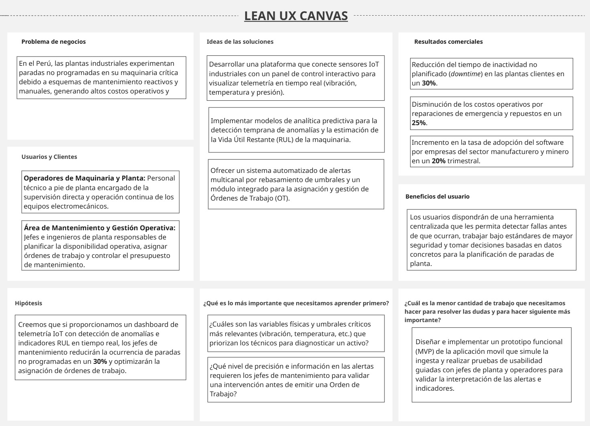

## 1.3. Segmentos objetivo

**Segmento Objetivo 1:**
Operadores de Maquinaria y Planta (Usuarios operativos)
Este segmento está conformado por el personal técnico a pie de planta directamente responsable de la operación diaria de la maquinaria, líneas de producción y equipos electromecánicos.

**Características demográficas:**

Edad: entre 22 y 55 años

Ubicación: Principales zonas e industrias de Lima Metropolitana, Callao y corredores industriales regionales del Perú

Nivel socioeconómico: medio-bajo y medio

Ocupación: operadores de maquinaria pesada, maquinistas de producción, técnicos de procesos y operadores de planta

Nivel educativo: técnico (carrera corta en electromecánica, mecánica industrial, electricidad o afines) o secundaria completa con capacitación técnica

**Características conductuales:**

Interactúan directamente y de forma continua con las máquinas durante sus turnos de trabajo.

Detectan anomalías operativas iniciales mediante ruidos, vibraciones o sobrecalentamiento.

Valoran plataformas intuitivas con visualizaciones claras de alerta (código de colores) que no entorpezcan su ritmo de trabajo.

Buscan reportar fallas de forma rápida sin depender de bitácoras manuales en papel.

Priorizan la seguridad laboral y prefieren evitar la operación de activos en estado crítico de falla.

**Sustento estadístico:**
Según datos del Instituto Nacional de Estadística e Informática (INEI), el sector manufacturero y minero emplea a más del 11% de la Población Económicamente Activa (PEA) ocupada en el Perú, con un alto porcentaje concentrado en puestos de ejecución técnica y operativa. Adicionalmente, reportes de OSINERGMIN y Mintra señalan que cerca del 30% de los accidentes de trabajo en entornos industriales están vinculados a la manipulación o falla de maquinaria sin mantenimiento adecuado, respaldando la necesidad de herramientas de fácil uso a nivel operativo.

**Segmento Objetivo 2:**
Área de Mantenimiento y Gestión Operativa (Decisores y planificadores)
Este segmento está compuesto por los responsables de la planificación estratégica, ejecución de mantenimientos y toma de decisiones sobre la continuidad operativa y presupuestal de los activos de la planta.

**Características demográficas:**

Edad: entre 28 y 60 años

Ubicación: Centros industriales, fábricas y plantas de operaciones en Lima Metropolitana y principales regiones industriales

Nivel socioeconómico: medio y medio-alto

Ocupación: Jefes de Mantenimiento, Ingenieros de Planta, Supervisores de Mantenimiento y Gerentes de Operaciones

Nivel educativo: profesional universitario (Ingeniería Mecánica, Mecatrónica, Electrónica, Industrial o afines) o grado técnico superior

**Características conductuales:**

Tienen la responsabilidad de reducir los tiempos de inactividad no planificada (downtime) y optimizar el presupuesto del área.

Priorizan la toma de decisiones basada en datos concretos (Métricas OEE, RUL, historial de anomalías y tendencias).

Buscan automatizar la generación y asignación de Órdenes de Trabajo (OT) a los técnicos.

Valoran la integración de tecnologías IoT y analítica predictiva para migrar de un enfoque correctivo/preventivo rígido a uno predictivo.

Requieren paneles de control (dashboards) centralizados y reportes descargables para evaluar el ROI del mantenimiento.

**Sustento estadístico:**
De acuerdo con la Sociedad Nacional de Industrias (SNI) y análisis del sector manufacturero, los costos asociados a las paradas no programadas de planta y a la gestión reactiva absorben entre el 25% y 35% del presupuesto operativo de las empresas industriales en el Perú. Asimismo, estudios globales de McKinsey sobre la Industria 4.0 indican que la adopción de mantenimiento predictivo en el área de ingeniería reduce los costos de reparación en un 20% y extiende la vida útil de los activos hasta en un 40%, evidenciando la necesidad de este segmento por soluciones B2B especializadas.

# Capítulo II: Requirements Development and Software Solution Design

## 2.1. Competidores

### 2.1.1. Análisis competitivo

**Tabla 2:** *Matriz de Análisis Competitivo para el Sistema de Mantenimiento Predictivo.*

| Criterio / Característica | **PredictiveMaintain (Nuestra Solución)** | **Fracttal One** | **Fiix (Rockwell Automation)** | **Augury (Halo)** |
| :--- | :--- | :--- | :--- | :--- |
| **Perfil General** | SaaS B2B peruano focalizado en analítica predictiva IoT e ingesta de telemetría para PYMEs y medianas industrias. | CMMS/EAM basado en nube con fuerte presencia en Latinoamérica enfocado en gestión de activos. | CMMS empresarial global de alta complejidad integrado al ecosistema de automatización industrial. | Solución especializada de IA y hardware IoT dedicada exclusivamente a la salud de máquinas rotativas. |
| **Monitoreo IoT en Tiempo Real** | **Alto:** Captura en tiempo real de temperatura, vibración y presión con tableros dinámicos. | **Medio:** Requiere integraciones API externas complejas para lectura en vivo de sensores. | **Alto:** Excelente integración con PLC/SCADA Rockwell, pero costoso e inaccesible para PYMEs. | **Alto:** Sensores propios continuos optimizados para equipos industriales críticos. |
| **Analítica Predictiva (RUL y Anomalías)** | **Alto:** Algoritmos dedicados para estimar la Vida Útil Restante (RUL) y detectar desvíos incipientes. | **Bajo:** Enfoque principal en mantenimiento preventivo por calendario/lecturas de contadores. | **Medio:** Incluye módulos predictivos avanzados únicamente en licencias Enterprise. | **Muy Alto:** Modelos de Machine Learning altamente entrenados en fallas mecánicas. |
| **Gestión de Órdenes de Trabajo (OT)** | **Sí:** Generación automática de OT activada por sobrepaso de umbrales críticos de sensores. | **Muy Alto:** Workflow avanzado de aprobación, firmas digitales e inventarios. | **Muy Alto:** Gestión completa de flujo de trabajo industrial, repuestos y costos. | **Limitado:** Se enfoca en el diagnóstico; requiere integrarse a un CMMS externo para gestión de OT. |
| **Facilidad de Uso e Interfaz** | **Alta:** Diseñado para **Operadores** a pie de planta y **Jefes de Mantenimiento** con curva rápida. | **Alta:** Interfaz moderna y multiplataforma orientada a la gestión. | **Media/Baja:** Interfaz compleja con requerimiento de capacitación técnica prolongada. | **Media:** Orientada principalmente a ingenieros de confiabilidad y analistas de datos. |
| **Modelo de Precios y Costo** | **Accesible:** Suscripción SaaS por activo conectado, adaptada al mercado industrial regional. | **Medio:** Cobro por usuario/mes; escala rápidamente según los módulos habilitados. | **Alto:** Licenciamiento costoso en dólares orientado a grandes corporaciones. | **Muy Alto:** Modelo "Hardware-as-a-Service" con contratos anuales elevados. |

---

### 2.1.2. Estrategias y tácticas frente a competidores

* **Integración vertical a Orden de Trabajo" sin fricción:** PredictiveMaintain conecta directamente la anomalía detectada por el sensor con la creación automática de la Orden de Trabajo (OT), reduciendo el tiempo de atención de fallas.
* **Enfoque en accesibilidad tecnológica para el mercado:** Ofrecer un modelo  escalable por volumen de activos conectados, haciendo viable la adopción de mantenimiento predictivo para medianas y PYMEs industriales que no pueden financiar licencias Enterprise como Fiix.
* **Diseño centrado en la usabilidad del Operador de Planta:** Desarrollar interfaces con códigos cromáticos de alerta de lectura rápida y navegación simplificada, reduciendo los tiempos de capacitación y facilitando el reporte directo desde la línea de producción.
* **Métricas predictivas simplificadas:** Presentar indicadores de Vida Útil Restante y niveles de riesgo de forma comprensible para los **Jefes de Mantenimiento**, evitando reportes matemáticos densos que requieren ingenieros especializados en vibraciones.

---

## 2.2. Entrevistas
### 2.2.1. Diseño de entrevistas

Para la validación de necesidades del proyecto, se diseñaron dos guías de entrevistas semiestructuradas orientadas a los dos segmentos objetivo del sistema:

---

**Segmento #1: Operador de Maquinaria y Planta (Usuario Operativo)**

**Preguntas principales:**
- ¿Cómo te va actualmente con la forma en que identificas y reportas las fallas mecánicas en los equipos de tu turno?
- ¿Qué haces normalmente cuando notas que una máquina crítica empieza a sonar mal, vibrar o sobrecalentarse durante la producción?
- ¿Qué tan fácil o difícil te resulta registrar una falla en las bitácoras o avisar al equipo de mantenimiento sin interrumpir tu trabajo diario?
- Cuando has reportado una avería antes, ¿qué fue lo que más te preocupó (sufrir un accidente laboral, parar la línea de producción, que te culpen por la falla)?
- ¿Qué cosas valoras más al momento de operar una máquina (seguridad en el puesto, claridad de los indicadores, rapidez de respuesta ante un fallo, herramientas fáciles de usar)?
- ¿Con qué frecuencia recibes alertas tempranas sobre el estado real de la maquinaria antes de que se detenga por completo?
- ¿Te ha pasado que una falla inesperada en la máquina haya detenido la producción por horas o generado un riesgo para tu seguridad? ¿Cómo lo resolvieron?
- ¿Estarías dispuesto a utilizar una aplicación o pantalla con semáforos visuales (verde, amarillo, rojo) que te alerte el estado de la máquina en tiempo real? ¿Por qué?
- ¿Qué funcionalidades crees que te facilitarían el trabajo diario (alertas sonoras/visuales, reporte rápido en 1 clic, historial simple de la máquina, estado del sensor en vivo)?

**Preguntas complementarias:**
- ¿Dónde o a través de qué medio reportas actualmente los problemas de la maquinaria (radio, WhatsApp, formato en papel, aviso verbal al supervisor)?
- ¿Has utilizado previamente pantallas industriales o herramientas digitales para monitorear equipos? ¿Cómo fue tu experiencia?
- ¿Qué tan cómodo te sientes usando una interfaz digital a pie de planta en comparación con los formatos físicos de papel?
- ¿Qué tan dispuesto estarías a formar parte de un proceso donde los operadores tengan control directo y en tiempo real sobre la salud del equipo?

---

#### **Segmento #2: Área de Mantenimiento y Gestión Operativa (Jefe de Mantenimiento / Ingeniero de Planta)**

**Preguntas principales:**
- ¿Cómo está actualmente la planta con la forma en que gestionan las fallas e intervenciones de la maquinaria crítica?
- ¿Qué haces normalmente cuando ocurre una parada de línea no programada por avería de un motor, bomba o compresor?
- ¿Qué tan fácil o difícil te resulta predecir la vida útil restante de un componente clave antes de que ocurra una falla catastrófica?
- Cuando coordinas un mantenimiento correctivo de emergencia, ¿qué es lo que más te preocupa (costo por hora de inactividad, disponibilidad de repuestos, seguridad del personal, perder cuotas de producción)?
- ¿Qué cosas valoras más al evaluar el rendimiento del área de mantenimiento (disponibilidad de planta, reducción de costos, automatización de órdenes de trabajo, precisión del diagnóstico)?
- ¿Con qué frecuencia realizan mantenimiento preventivo por calendario y cuántas piezas reemplazan que aún se encuentran en buen estado?
- ¿Te ha pasado que un diagnóstico tardío haya provocado la destrucción total de un activo y cuantiosas pérdidas económicas? ¿Cómo lo resolvieron?
- ¿Estarías dispuesto a pagar una suscripción SaaS por un software que conecte sensores IoT y prediga fallas con anticipación? ¿Por qué?
- ¿Qué funcionalidades crees que te facilitarían la gestión desde una plataforma (dashboard centralizado de la planta, estimación RUL de activos, alertas automáticas por umbral, generación y asignación de Órdenes de Trabajo)?

**Preguntas complementarias:**
- ¿Dónde o con qué herramientas gestionas actualmente el plan de mantenimiento de la empresa (Excel, tarjetas Kanban físicas, software CMMS/ERP costoso)?
- ¿Cuentan actualmente con sensores IoT instalados en sus activos o qué tan viable ven su integración a corto plazo?
- ¿Cómo es el proceso actual desde que se detecta una anomalía hasta que el técnico recibe la Orden de Trabajo firmada?
- ¿Qué tan dispuesto estarías a migrar de un esquema de mantenimiento preventivo rígido a una cultura de mantenimiento predictivo basada en analítica de datos?

---

### 2.2.2. Registro de entrevistas

**Entrevista 1 (Segmento 1: Operadores de Maquinaria y Planta)**
* **Entrevistado:** Jorge Luis Mendoza (38 años)
* **Cargo:** Operador Senior de Maquinaria y Embotellado
* **Ubicación / Empresa:** Planta Industrial en Ate, Lima
* **Duración:** 25 minutos
* **Resumen de respuestas:** Jorge comenta que las fajas transportadoras y los motores de llenado sufren sobrecalentamientos constantes. Actualmente detectan las fallas cuando sienten "un olor a quemado o una vibración fuerte". Reportar la falla requiere llenar un formato físico y buscar al supervisor, lo que puede tomar hasta 40 minutos mientras la máquina sigue operando forzada. Muestra gran interés en tener un panel con colores verde/amarillo/rojo para detener o ajustar la máquina a tiempo.
* **Evidencia en video / audio:** [Enlace a grabación de entrevista 1]

**Entrevista 2 (Segmento 2: Área de Mantenimiento y Gestión Operativa)**
* **Entrevistado:** Ing. Carlos Ramírez (46 años)
* **Cargo:** Jefe de Mantenimiento Planta
* **Ubicación / Empresa:** Empresa de Procesamiento de Plásticos, Callao
* **Duración:** 35 minutos
* **Resumen de respuestas:** El Ing. Ramírez señala que las paradas no programadas les cuestan un promedio de $3,500 por hora de inactividad. Manejan el mantenimiento preventivo con Excel y tarjetas físicas. Su mayor problema es que reemplazan piezas en buen estado por calendario, o intervienen tarde cuando el rodamiento ya destruyó el eje del motor. Requiere un sistema que le diga la **Vida Útil Restante (RUL)** estimada del activo y que genere automáticamente la Orden de Trabajo para enviar al técnico inmediatamente.
* **Evidencia en video / audio:** [Enlace a grabación de entrevista 2]

**Entrevista (Segmento 2: Área de Mantenimiento y Gestión Operativa)**
* **Entrevistado:** Jorge Salazar (50 años)
* **Cargo:** Supervisor de Mantenimiento
* **Ubicación / Empresa:** Planta de manufactura mediana, rubro metalmecánico, San Juan de Lurigancho, Lima
* **Duración:** 5 minutos
* **Resumen de respuestas:** Jorge señala que el plan de mantenimiento de su planta es mayormente reactivo y preventivo por calendario, con frecuencias fijas de revisión que no reflejan el desgaste real de los activos. Estima que una parada de línea crítica puede costar entre S/. 3,000 y S/. 8,000 por hora, y que aproximadamente un tercio del presupuesto anual del área se destina a emergencias no planificadas. La asignación de órdenes de trabajo se gestiona verbalmente o por WhatsApp, con registro en Excel que frecuentemente queda desactualizado. Indica que el cálculo del OEE se realiza de forma manual y mensual, y que consolidar los datos para presentar a Gerencia puede tomar varias horas. Respecto a herramientas previas, señala que los CMMS evaluados resultaban costosos o rígidos para el tamaño de su operación, sin integración real con sensores IoT. Como requisitos indispensables para adoptar una solución, menciona: interfaz simple de usar desde el celular, alertas con anticipación antes de que falle la línea, generación automática de órdenes de trabajo, y un modelo de precios accesible para plantas medianas.
* **Evidencia en video / audio:**[Enlace a grabacion entrevista 3](https://upcedupe-my.sharepoint.com/:v:/g/personal/u201916755_upc_edu_pe/IQBz20sD2aUtQrsNGRWGmxHJAeQC4lye6AYGKppsCWPJrRg?nav=eyJyZWZlcnJhbEluZm8iOnsicmVmZXJyYWxBcHAiOiJPbmVEcml2ZUZvckJ1c2luZXNzIiwicmVmZXJyYWxBcHBQbGF0Zm9ybSI6IldlYiIsInJlZmVycmFsTW9kZSI6InZpZXciLCJyZWZlcnJhbFZpZXciOiJNeUZpbGVzTGlua0NvcHkifX0&e=yxNGsL)
* 

---

### 2.2.3. Análisis de entrevistas

1. Detección tardía y métodos empíricos (Operadores)
* **Hallazgo:** Los operadores dependen en más de un 80% de sus sentidos (oído, tacto, olor) para detectar fallas en las máquinas.
* **Necesidad:** Requieren sensores IoT que traduzcan las lecturas de vibración y temperatura en **indicadores visuales simples y en tiempo real** directos en pantalla, evitando que dependan de la percepción humana.

2. Alto costo de la inactividad no planificada (Gestores de Mantenimiento)
* **Hallazgo:** Las paradas intempestivas representan sobrecostos severos por horas extra de personal técnico e importación de repuestos de emergencia.
* **Necesidad:** Los jefes de planta demandan algoritmos de **detección de anomalías** e indicadores de **RUL (Remaining Useful Life)** para programar las intervenciones durante los cambios de turno o paradas planificadas.

3. Fricción en el flujo de reporte y asignación de órdenes (Proceso)
* **Hallazgo:** El uso de bitácoras de papel o reportes verbales genera pérdidas de tiempo de entre 30 y 60 minutos desde que se detecta el problema hasta que se emite la orden de reparación.
* **Necesidad:** El sistema debe **automatizar la generación de Órdenes de Trabajo (OT)** cuando los sensores superen los umbrales de alerta predefinidos, enviando notificaciones directas al personal de turno.

## 2.3. Needfinding

En esta sección se presentan los artefactos resultantes del proceso de análisis de la información recolectada en las entrevistas a los segmentos objetivo de PredictiveMaintain. A partir de los hallazgos obtenidos, el equipo construye los User Personas, el User Task Matrix, los User Journey Maps, los Empathy Maps, el Big Picture EventStorming y el Ubiquitous Language del dominio, buscando comprender en profundidad las necesidades, tareas y comportamientos de los Jefes de Mantenimiento/Gerentes de Planta y los Técnicos de Mantenimiento como actores principales del negocio.

### 2.3.1. User Personas
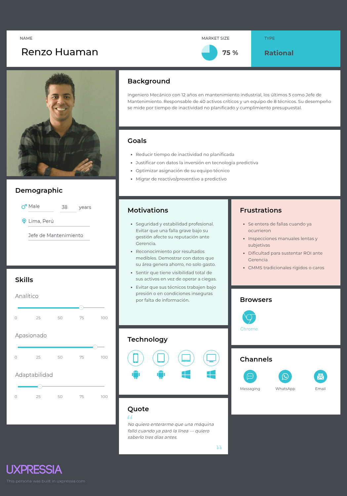
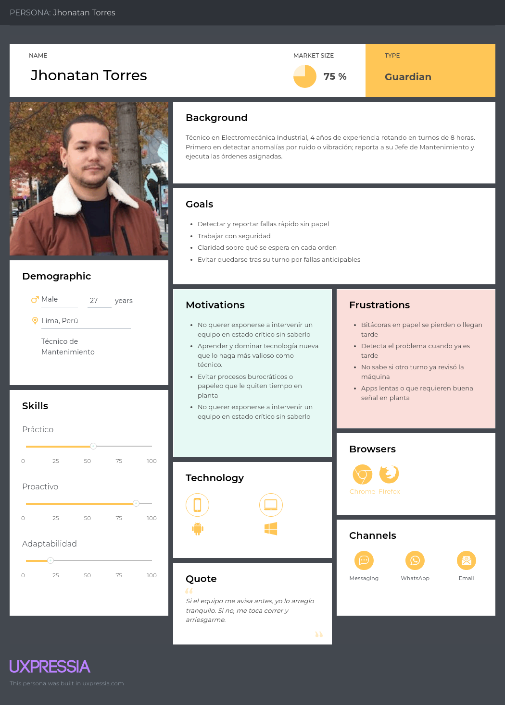
### 2.3.2. User Task Matrix

| Tarea | Renzo Huamán (Jefe de Mantenimiento) — Frecuencia / Importancia | Jhonatan Torres (Técnico de Mantenimiento) — Frecuencia / Importancia |
|---|---|---|
| Inspeccionar el estado físico de la maquinaria | Semanal / Media | Diaria / Alta |
| Detectar señales de anomalía durante la operación (ruido, vibración, calor) | No aplica | Diaria / Alta |
| Reportar una anomalía detectada al responsable correspondiente | Diaria / Alta (recibe reportes) | Diaria / Alta (emite reportes) |
| Registrar la intervención o mantenimiento realizado | Semanal / Media (revisa registros) | Diaria / Alta |
| Priorizar qué activos atender primero según su criticidad | Diaria / Alta | No aplica |
| Coordinar la asignación de personal técnico para una intervención | Diaria / Alta | No aplica |
| Planificar el presupuesto y los recursos de mantenimiento | Mensual / Alta | No aplica |
| Revisar el historial de fallas de un activo antes de intervenir | Semanal / Media | Diaria / Media |
| Verificar el cumplimiento de protocolos de seguridad antes de operar un equipo | Semanal / Media (supervisión) | Diaria / Alta |
| Sustentar ante la gerencia los resultados del área de mantenimiento | Mensual / Alta | No aplica |
| Capacitarse en nuevas tecnologías o procedimientos de mantenimiento | Mensual / Media | Mensual / Media |
| Comunicar el estado de una intervención al turno siguiente | No aplica | Diaria / Alta |

### 2.3.3. User Journey Mapping

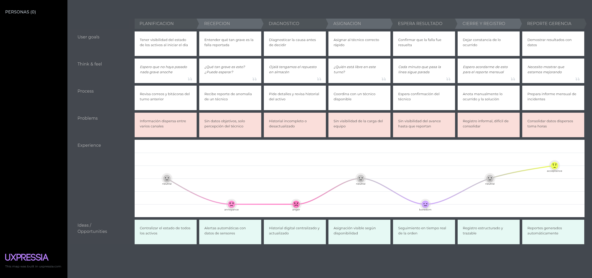
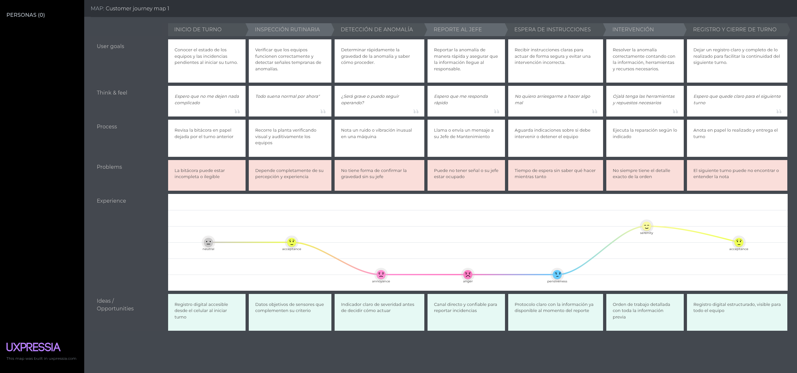

### 2.3.4. Empathy Mapping

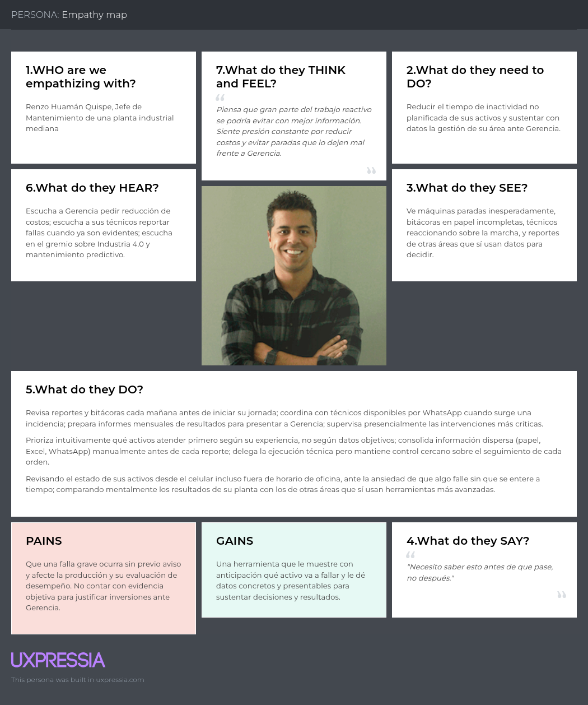
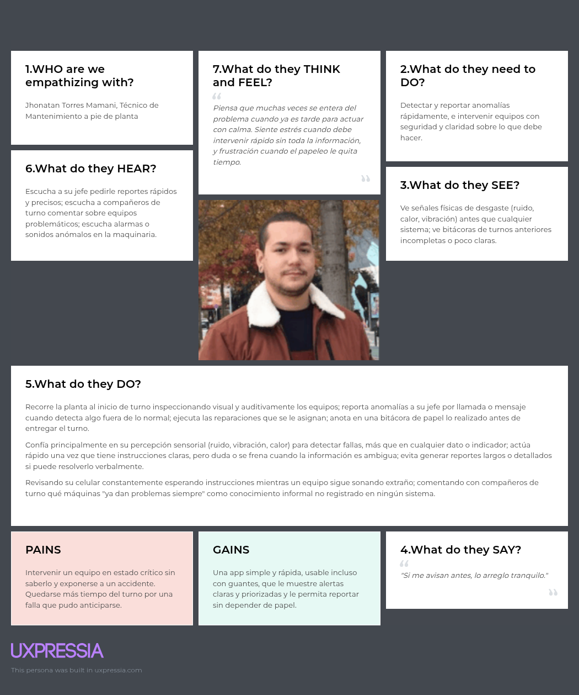

### 2.3.5. Big Picture EventStorming

La primera ocurre en el origen de la intervención: el proceso puede iniciar de forma reactiva, cuando un operador detecta una anomalía por percepción sensorial (vibración, olor, calor), o de forma preventiva, cuando el calendario de mantenimiento alcanza la fecha programada para un activo. Ambos caminos convergen en el momento en que el Jefe de Mantenimiento evalúa la situación sin contar con datos objetivos del estado real del activo.

La segunda bifurcación ocurre en el resultado de la intervención: al llegar al activo, el técnico puede encontrar el componente ya destruido (intervención tardía) o en buen estado (reemplazo prematuro por calendario rígido). En cualquiera de los dos casos, el activo vuelve a operación y el proceso cierra con un registro manual disperso entre papel, Excel y WhatsApp, dificultando el cálculo real de disponibilidad y OEE.

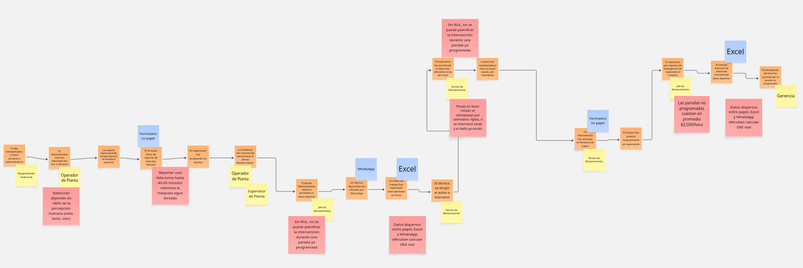

### 2.3.6. Ubiquitous Language

| Término (Inglés) | Término (Español) | Definición |
|---|---|---|
| **Asset** | Activo | Equipo o maquinaria industrial (motor, bomba, compresor, reductor, entre otros) que forma parte de la línea de producción de una planta y que es monitoreado por PredictiveMaintain para anticipar posibles fallas. |
| **Asset Criticality** | Criticidad del Activo | Nivel de importancia asignado a un activo en función del impacto que tendría su falla sobre la continuidad de la producción, la seguridad del personal o los costos operativos. |
| **Asset Lifecycle** | Ciclo de Vida del Activo | Conjunto de etapas por las que atraviesa un activo industrial desde su puesta en operación hasta su reemplazo o baja, incluyendo los periodos de funcionamiento normal, desgaste, intervención y recuperación. |
| **Availability** | Disponibilidad | Porcentaje de tiempo en el que un activo se encuentra operativo y en condiciones de cumplir su función dentro de un periodo determinado. |
| **Bearing** | Rodamiento | Componente mecánico que permite el movimiento rotativo de un eje con fricción reducida, y que constituye una de las piezas más propensas a fallas progresivas por desgaste en maquinaria industrial. |
| **Condition Monitoring** | Monitoreo de Condición | Práctica de observar continuamente el estado físico y operativo de un activo mediante la medición de variables físicas, con el fin de detectar señales tempranas de deterioro. |
| **Connected Asset** | Activo Conectado | Activo industrial que cuenta con uno o más sensores IoT instalados y transmitiendo información a la plataforma de monitoreo. |
| **Corrective Action** | Acción Correctiva | Intervención técnica realizada sobre un activo para subsanar una falla detectada o confirmada, registrada como parte del cierre de una orden de trabajo. |
| **Fault Diagnosis** | Diagnóstico de Fallas | Proceso de análisis de los datos e indicadores generados por un activo con el fin de determinar la causa probable de una anomalía detectada. |
| **Incipient Failure** | Falla Incipiente | Falla en una etapa temprana de desarrollo, que aún no afecta de forma crítica el funcionamiento del activo, pero que puede evolucionar hacia una falla catastrófica si no es atendida oportunamente. |
| **Industry 4.0** | Industria 4.0 | Paradigma de transformación industrial caracterizado por la integración de tecnologías digitales, sensórica IoT y analítica de datos en los procesos productivos, con el objetivo de optimizar la eficiencia operativa. |
| **Physical Variable** | Variable Física | Magnitud medible por un sensor IoT sobre un activo industrial, tal como vibración, temperatura, presión, amperaje o nivel de ruido, utilizada para evaluar su condición operativa. |
| **Plant Manager** | Gerente de Planta / Jefe de Mantenimiento | Persona responsable de la operación y el desempeño de mantenimiento de una planta industrial, encargada de tomar decisiones sobre la asignación de recursos técnicos y la gestión de activos críticos. |
| **Predictive Alert** | Alerta Predictiva | Notificación generada por la plataforma cuando el análisis de las lecturas de un activo identifica un patrón de comportamiento anómalo asociado a una probable falla futura. |
| **Predictive Maintenance** | Mantenimiento Predictivo | Estrategia de mantenimiento que utiliza el monitoreo continuo de variables físicas y modelos analíticos para anticipar fallas antes de que ocurran, a diferencia del mantenimiento reactivo o preventivo rígido. |
| **Preventive Maintenance** | Mantenimiento Preventivo | Estrategia de mantenimiento basada en intervenciones programadas por calendario o uso, independientemente de la condición real del activo en el momento de la intervención. |
| **Reactive Maintenance** | Mantenimiento Reactivo | Estrategia de mantenimiento en la que la intervención sobre un activo se realiza únicamente después de que ha ocurrido una falla. |
| **Sensor** | Sensor | Dispositivo IoT instalado físicamente en un activo industrial, encargado de capturar y transmitir mediciones de una variable física determinada. |
| **Sensor Communication Loss** | Pérdida de Comunicación del Sensor | Situación en la que un sensor deja de transmitir lecturas a la plataforma durante un periodo mayor al esperado, lo cual puede indicar una falla en el dispositivo, en la red o en el suministro eléctrico. |
| **Severity Level** | Nivel de Severidad | Clasificación asignada a una alerta predictiva según el grado de riesgo o urgencia que representa para la operación del activo, utilizada para priorizar la atención del equipo de mantenimiento. |
| **Subscription Plan** | Plan de Suscripción | Modalidad comercial mediante la cual una empresa cliente contrata el uso de la plataforma PredictiveMaintain, con un límite de activos conectados según el nivel contratado. |
| **Threshold** | Umbral | Valor límite configurado para una variable física de un activo, cuya superación indica una condición fuera del rango operativo considerado normal. |
| **Unplanned Downtime** | Parada No Programada | Interrupción no planificada de la operación de un activo o línea de producción, generalmente ocasionada por una falla imprevista, que genera pérdidas económicas y operativas. |
| **Work Order** | Orden de Trabajo | Documento generado dentro de la plataforma a partir de una alerta confirmada, que registra la asignación, ejecución y cierre de una intervención de mantenimiento sobre un activo. |

## 2.4. Requirements specification

En esta sección se presenta la especificación de los requisitos de PredictiveMaintain, resultado del análisis de la información obtenida en el proceso de investigación. Se incluyen los User Stories y Technical Stories con sus respectivos Acceptance Criteria en formato Gherkin, las Spike Stories orientadas a reducir la incertidumbre técnica del proyecto, el Impact Mapping que vincula los objetivos estratégicos del negocio con las funcionalidades a construir, y el Product Backlog priorizado.

### 2.4.1. User Stories

#### Epics

| Epic ID | Título | Descripción |
|---|---|---|
| EP-01 | Monitoreo en Tiempo Real de Activos | Como equipo, necesitamos monitorear en tiempo real las variables físicas de los activos industriales, para detectar comportamientos anómalos antes de que deriven en una falla. |
| EP-02 | Alertas y Diagnóstico Predictivo de Fallas | Como equipo, necesitamos generar alertas predictivas basadas en patrones anómalos de comportamiento y estimar la Vida Útil Restante (RUL) de los activos, para permitir intervenciones antes de una parada no planificada. |
| EP-03 | Gestión de Órdenes de Trabajo | Como equipo, necesitamos gestionar la creación, asignación y seguimiento de órdenes de trabajo derivadas de alertas confirmadas, para garantizar una atención trazable de las incidencias. |
| EP-04 | Registro y Administración de Activos Industriales | Como equipo, necesitamos registrar, actualizar y dar de baja activos industriales junto con sus sensores asociados, para mantener consistente el alcance del monitoreo predictivo. |
| EP-05 | Reportes y Analítica Histórica | Como equipo, necesitamos generar reportes históricos de fallas, disponibilidad, Eficiencia General de los Equipos (OEE) y desempeño comparativo de los activos, para soportar la toma de decisiones de mantenimiento. |
| EP-06 | Gestión de Suscripción y Planes | Como equipo, necesitamos gestionar los planes de suscripción según el volumen de activos conectados, para sostener el modelo de negocio de la plataforma. |
| EP-07 | Gestión de Identidad y Acceso | Como equipo, necesitamos gestionar el registro, autenticación y perfiles de los usuarios (Jefe de Mantenimiento, Técnico), para garantizar acceso seguro y diferenciado a la plataforma. |
| EP-08 | Experiencia en Landing Page | Como equipo, necesitamos un Landing Page informativo que comunique la propuesta de valor de PredictiveMaintain a los segmentos objetivo. |
| EP-09 | Integración de Sensores IoT y Servicios Backend | Como equipo, necesitamos exponer servicios backend que permitan la ingesta, procesamiento y explotación de la información generada por los sensores IoT y el modelo predictivo. |

#### User Stories y Technical Stories

| Epic / Story ID | Título | Descripción | Criterios de Aceptación | Relacionado con (Epic ID) |
|---|---|---|---|---|
| US-01 | Visualizar variables físicas de un activo en tiempo real | Como Técnico de Mantenimiento, deseo visualizar en tiempo real las variables físicas de un activo industrial, para detectar comportamientos anómalos antes de que deriven en una falla. | **Escenario 1: Lectura de variables disponible** Dado que el activo cuenta con sensores IoT conectados y transmitiendo datos Cuando el sistema recibe una nueva lectura de variables físicas del activo Entonces el sistema actualiza y expone los valores actuales de cada variable registrada  **Escenario 2: Activo sin comunicación** Dado que un activo deja de transmitir datos por un periodo mayor a 5 minutos Cuando el sistema evalúa el estado de comunicación del activo Entonces el sistema marca el estado del activo como "sin comunicación" junto con la marca de tiempo de la última lectura recibida  **Escenario 3: Valor fuera de rango** Dado que los valores de una variable física superan el rango normal configurado para el activo Cuando el sistema procesa la lectura entrante Entonces el sistema clasifica dicha variable como valor fuera de rango | EP-01 |
| US-02 | Consultar listado de activos por planta y su estado de comunicación | Como Jefe de Mantenimiento, deseo consultar el listado de activos de mi planta junto con su estado de comunicación actual, y filtrarlo por línea de producción o tipo de sensor, para identificar rápidamente equipos que requieren atención. | **Escenario 1: Listado con estados** Dado que existen activos registrados en la planta Cuando se consulta el listado Entonces el sistema retorna cada activo con su estado ("operativo", "en alerta", "sin comunicación")  **Escenario 2: Filtro por estado** Dado que se filtra el listado por estado "en alerta" Cuando se aplica el filtro Entonces el sistema retorna únicamente los activos que cumplen dicha condición  **Escenario 3: Filtro por línea de producción** Dado que se filtra el listado por línea de producción Cuando se aplica el filtro Entonces el sistema retorna únicamente los activos asociados a dicha línea  **Escenario 4: Filtro por tipo de sensor** Dado que se filtra el listado por tipo de sensor asociado Cuando se aplica el filtro Entonces el sistema retorna únicamente los activos que cuentan con ese tipo de sensor | EP-01 |
| US-03 | Configurar umbrales de variables físicas por activo | Como Jefe de Mantenimiento, deseo configurar los umbrales normales de cada variable física por activo, para que el sistema pueda identificar correctamente los valores fuera de rango. | **Escenario 1: Configuración válida** Dado que se ingresan valores mínimo y máximo válidos para una variable Cuando se guarda la configuración Entonces el sistema actualiza el umbral y lo aplica a las lecturas futuras  **Escenario 2: Rango inválido** Dado que se ingresa un valor mínimo mayor al máximo Cuando se intenta guardar la configuración Entonces el sistema rechaza la operación e indica el error de rango | EP-01 |
| US-04 | Recibir alerta predictiva de falla incipiente | Como Jefe de Mantenimiento, deseo recibir una alerta cuando el sistema detecte un patrón anómalo asociado a una posible falla, para programar una intervención antes de una parada no planificada. | **Escenario 1: Generación de alerta** Dado que el modelo predictivo identifica un patrón anómalo Cuando se supera el umbral de confianza configurado Entonces el sistema genera una alerta con su nivel de severidad  **Escenario 2: Notificación al responsable** Dado que se genera una alerta de severidad alta Cuando el Jefe de Mantenimiento está registrado como responsable del activo Entonces el sistema lo notifica de forma inmediata  **Escenario 3: Registro de estado** Dado que una alerta ha sido generada Cuando se actualiza su estado Entonces el sistema lo registra como "en revisión", "confirmada" o "descartada"  **Escenario 4: Descarte con motivo obligatorio** Dado que una alerta es marcada como "descartada" Cuando se registra el descarte Entonces el sistema exige un motivo antes de aceptar el cambio | EP-02 |
| US-05 | Visualizar detalle diagnóstico de una alerta | Como Técnico de Mantenimiento, deseo visualizar el detalle diagnóstico de una alerta, incluyendo las variables y valores que la originaron, para comprender la causa probable antes de intervenir. | **Escenario 1: Detalle disponible** Dado que una alerta existe en el sistema Cuando el técnico consulta su detalle Entonces el sistema muestra las variables físicas, valores registrados y el umbral que fue superado  **Escenario 2: Múltiples variables involucradas** Dado que una alerta fue generada por múltiples variables simultáneamente Cuando se consulta el detalle Entonces el sistema lista cada variable involucrada de forma independiente | EP-02 |
| US-06 | Configurar destinatarios y canal de notificación de alertas por planta | Como Jefe de Mantenimiento, deseo configurar qué usuarios reciben notificaciones de alertas según la planta o tipo de activo, y por qué canal las reciben, para asegurar que la persona correcta sea informada de la forma más oportuna. | **Escenario 1: Asignación de destinatario** Dado que se asigna un usuario como destinatario de un tipo de activo Cuando se genera una alerta de ese tipo Entonces el sistema lo incluye en la notificación  **Escenario 2: Sin destinatario configurado** Dado que no existe ningún destinatario configurado para un activo Cuando se genera una alerta Entonces el sistema notifica al responsable general de la planta por defecto  **Escenario 3: Selección de canal de notificación** Dado que se configura un destinatario para un tipo de activo Cuando se selecciona el canal de notificación preferido (push o correo electrónico) Entonces el sistema envía las alertas futuras por el canal configurado | EP-02 |
| US-30 | Consultar la Vida Útil Restante (RUL) estimada de un activo | Como Jefe de Mantenimiento, deseo consultar la Vida Útil Restante estimada de un activo crítico, para planificar su intervención o reemplazo antes de que ocurra una falla catastrófica. | **Escenario 1: Estimación disponible** Dado que un activo cuenta con historial suficiente de lecturas Cuando el modelo predictivo calcula su RUL Entonces el sistema expone el valor estimado en días u horas de operación restante  **Escenario 2: Historial insuficiente** Dado que un activo no cuenta con historial suficiente para una estimación confiable Cuando se consulta su RUL Entonces el sistema indica que la estimación aún no está disponible para dicho activo  **Escenario 3: RUL por debajo del umbral crítico** Dado que el RUL estimado de un activo cae por debajo de un umbral crítico configurado Cuando el sistema recalcula el indicador Entonces genera una alerta de planificación de reemplazo o intervención preventiva | EP-02 |
| US-07 | Generar orden de trabajo a partir de una alerta confirmada | Como Técnico de Mantenimiento, deseo generar una orden de trabajo directamente a partir de una alerta confirmada, para atender la incidencia de forma trazable y priorizada. | **Escenario 1: Creación de orden** Dado que una alerta está marcada como "confirmada" Cuando se genera una orden de trabajo asociada Entonces el sistema la crea con estado "pendiente" y la vincula a la alerta de origen  **Escenario 2: Historial de estados** Dado que una orden de trabajo existe Cuando se actualiza su estado Entonces el sistema registra el historial de cambios con fecha y usuario responsable  **Escenario 3: Cierre con acciones correctivas** Dado que una orden es marcada como "completada" Cuando se confirma su finalización Entonces el sistema exige el registro de las acciones correctivas realizadas | EP-03 |
| US-08 | Asignar orden de trabajo a un técnico | Como Jefe de Mantenimiento, deseo asignar una orden de trabajo a un técnico específico, para distribuir la carga de intervenciones según disponibilidad y especialidad. | **Escenario 1: Asignación exitosa** Dado que una orden de trabajo está en estado "pendiente" y sin asignar Cuando se le asigna un técnico Entonces el sistema actualiza la orden con el responsable y notifica al técnico  **Escenario 2: Reasignación** Dado que se intenta asignar una orden ya asignada a otro técnico Cuando se procesa la reasignación Entonces el sistema registra el cambio y notifica a ambos técnicos involucrados | EP-03 |
| US-09 | Adjuntar evidencia fotográfica a una orden de trabajo | Como Técnico de Mantenimiento, deseo adjuntar fotografías del activo intervenido a una orden de trabajo, para documentar el estado antes y después de la intervención. | **Escenario 1: Carga exitosa** Dado que una orden de trabajo está en curso Cuando se adjunta una fotografía válida Entonces el sistema la almacena y la asocia a la orden correspondiente  **Escenario 2: Formato no soportado** Dado que se intenta adjuntar un archivo que no corresponde a un formato de imagen soportado Cuando se procesa la carga Entonces el sistema rechaza el archivo e indica el formato esperado | EP-03 |
| US-10 | Consultar listado de órdenes de trabajo pendientes | Como Jefe de Mantenimiento, deseo consultar el listado de órdenes de trabajo pendientes de mi planta, para dar seguimiento al avance de las intervenciones. | **Escenario 1: Listado filtrado** Dado que existen órdenes de trabajo registradas Cuando se consulta el listado filtrado por estado "pendiente" Entonces el sistema retorna las órdenes que cumplen dicha condición  **Escenario 2: Sin órdenes pendientes** Dado que no existen órdenes pendientes en la planta Cuando se consulta el listado Entonces el sistema indica que no hay órdenes pendientes registradas | EP-03 |
| US-11 | Registrar un nuevo activo industrial | Como Jefe de Mantenimiento, deseo registrar un nuevo activo industrial junto con sus sensores asociados y la línea de producción a la que pertenece, para incorporarlo al monitoreo predictivo de la planta. | **Escenario 1: Registro exitoso** Dado que se cuenta con la información técnica del activo (tipo, ubicación, criticidad) Cuando se registra el activo Entonces el sistema almacena la ficha con un identificador único  **Escenario 2: Asociación de sensores válidos** Dado que un activo ha sido registrado Cuando se le asocian sensores IoT Entonces el sistema valida que cada sensor corresponda a una variable física soportada  **Escenario 3: Registro incompleto** Dado que se intenta registrar un activo sin un dato obligatorio Cuando se procesa el registro Entonces el sistema lo rechaza e indica el campo faltante | EP-04 |
| US-12 | Editar ficha de un activo existente | Como Jefe de Mantenimiento, deseo editar la información de un activo ya registrado, para mantener actualizados sus datos técnicos y de criticidad. | **Escenario 1: Edición exitosa** Dado que un activo existe en el sistema Cuando se actualizan sus datos con valores válidos Entonces el sistema guarda los cambios y conserva su identificador original  **Escenario 2: Dato inválido** Dado que se intenta actualizar un activo con un dato inválido Cuando se procesa la edición Entonces el sistema rechaza el cambio e indica el error | EP-04 |
| US-13 | Dar de baja un activo del monitoreo | Como Jefe de Mantenimiento, deseo dar de baja un activo que ya no forma parte de la operación, para que deje de considerarse en el monitoreo y en el conteo del plan de suscripción. | **Escenario 1: Baja exitosa** Dado que un activo está registrado y activo Cuando se ejecuta la baja Entonces el sistema cambia su estado a "inactivo" y detiene el procesamiento de nuevas lecturas asociadas  **Escenario 2: Órdenes pendientes** Dado que un activo dado de baja cuenta con órdenes de trabajo pendientes Cuando se intenta dar de baja Entonces el sistema advierte sobre las órdenes abiertas antes de confirmar la operación | EP-04 |
| US-14 | Consultar historial de fallas y disponibilidad de un activo | Como Jefe de Mantenimiento, deseo consultar el historial de fallas, alertas y disponibilidad de un activo en un rango de fechas, para evaluar su desempeño y planificar su mantenimiento futuro. | **Escenario 1: Historial con eventos** Dado que un activo cuenta con eventos registrados Cuando se consulta el historial en un rango de fechas Entonces el sistema retorna la lista de eventos ocurridos en dicho periodo  **Escenario 2: Cálculo de disponibilidad** Dado que se solicita el reporte de disponibilidad Cuando el sistema calcula el indicador Entonces el resultado refleja el porcentaje de tiempo operativo respecto al tiempo total del periodo  **Escenario 3: Rango sin eventos** Dado que no existen eventos en el rango seleccionado Cuando se genera el reporte Entonces el sistema indica que no hay información disponible para dicho periodo | EP-05 |
| US-15 | Generar reporte comparativo de desempeño entre activos | Como Jefe de Mantenimiento, deseo comparar el desempeño de varios activos en un mismo periodo, para identificar cuáles presentan mayor frecuencia de fallas. | **Escenario 1: Comparativo generado** Dado que se seleccionan dos o más activos y un rango de fechas Cuando se genera el reporte comparativo Entonces el sistema retorna la cantidad de alertas y disponibilidad de cada activo lado a lado  **Escenario 2: Activo sin eventos** Dado que uno de los activos seleccionados no tiene eventos en el periodo Cuando se genera el reporte Entonces el sistema lo incluye con valores en cero sin afectar el resto del comparativo | EP-05 |
| US-16 | Exportar reporte histórico de mantenimiento | Como Jefe de Mantenimiento, deseo exportar el reporte histórico de un activo o planta, para compartirlo con la gerencia o auditorías externas. | **Escenario 1: Exportación exitosa** Dado que un reporte ha sido generado Cuando se solicita su exportación Entonces el sistema genera un archivo descargable con la información consultada  **Escenario 2: Reporte vacío** Dado que el reporte no contiene datos Cuando se solicita su exportación Entonces el sistema informa que no hay contenido disponible para exportar | EP-05 |
| US-31 | Consultar el indicador OEE de un activo o línea de producción | Como Jefe de Mantenimiento, deseo consultar el indicador de Eficiencia General de los Equipos (OEE) de un activo o línea de producción en un periodo determinado, para evaluar su rendimiento global y sustentar decisiones de inversión. | **Escenario 1: Cálculo exitoso** Dado que un activo cuenta con datos de disponibilidad y operación en el periodo consultado Cuando se calcula el OEE Entonces el sistema retorna el indicador junto con sus tres componentes (disponibilidad, rendimiento, calidad)  **Escenario 2: Componente no calculable** Dado que no existen datos suficientes para calcular alguno de los componentes del OEE Cuando se genera el reporte Entonces el sistema indica qué componente no pudo calcularse y muestra los disponibles | EP-05 |
| US-17 | Actualizar plan de suscripción según volumen de activos | Como Jefe de Mantenimiento (en representación de la empresa cliente), deseo actualizar el plan de suscripción cuando el número de activos conectados exceda el límite del plan actual, para mantener el monitoreo activo sobre todos los equipos. | **Escenario 1: Límite alcanzado** Dado que la cantidad de activos alcanza el límite del plan contratado Cuando se intenta registrar un nuevo activo Entonces el sistema notifica que se requiere una actualización de plan  **Escenario 2: Actualización exitosa** Dado que se selecciona un plan de mayor capacidad Cuando se confirma el cambio Entonces el sistema habilita el registro de activos adicionales conforme al nuevo límite  **Escenario 3 (regla de negocio):** El sistema no permite la reducción de plan si la cantidad de activos registrados supera el límite del plan destino | EP-06 |
| US-18 | Consultar consumo actual de la suscripción | Como Jefe de Mantenimiento, deseo consultar cuántos activos tengo registrados respecto al límite de mi plan actual, para anticipar la necesidad de una actualización. | **Escenario 1: Consumo visible** Dado que la empresa tiene un plan activo Cuando se consulta el panel de suscripción Entonces el sistema muestra el número de activos usados frente al límite contratado  **Escenario 2: Advertencia de proximidad** Dado que el consumo alcanza el 90% del límite del plan Cuando se consulta el panel Entonces el sistema resalta una advertencia de proximidad al límite | EP-06 |
| US-19 | Recibir notificación de vencimiento de suscripción | Como Jefe de Mantenimiento, deseo recibir una notificación previa al vencimiento de mi suscripción, para renovarla sin interrumpir el monitoreo de mis activos. | **Escenario 1: Notificación previa** Dado que la suscripción vence en un plazo menor o igual a 7 días Cuando el sistema evalúa las fechas de vencimiento Entonces notifica al responsable de la cuenta  **Escenario 2: Bloqueo por vencimiento** Dado que la suscripción vence sin haberse renovado Cuando se cumple la fecha de vencimiento Entonces el sistema restringe el acceso al monitoreo y notifica el bloqueo | EP-06 |
| US-20 | Registrar cuenta corporativa | Como Jefe de Mantenimiento, deseo registrar la cuenta de mi empresa en la plataforma, para habilitar el acceso de mi equipo al monitoreo predictivo. | **Escenario 1: Registro exitoso** Dado que se ingresan datos corporativos válidos (correo, contraseña, razón social) Cuando se envía el registro Entonces el sistema crea la cuenta y la asocia a un plan de suscripción inicial  **Escenario 2: Correo duplicado** Dado que el correo ingresado ya está registrado Cuando se envía el registro Entonces el sistema rechaza la operación e indica que la cuenta ya existe | EP-07 |
| US-21 | Iniciar sesión en la plataforma | Como usuario registrado, deseo iniciar sesión con mis credenciales, para acceder a las funcionalidades correspondientes a mi rol. | **Escenario 1: Inicio de sesión exitoso** Dado que las credenciales ingresadas son correctas Cuando se procesa el inicio de sesión Entonces el sistema concede acceso según el rol del usuario  **Escenario 2: Credenciales incorrectas** Dado que las credenciales son incorrectas Cuando se procesa el inicio de sesión Entonces el sistema rechaza el acceso sin especificar cuál dato es erróneo | EP-07 |
| US-22 | Recuperar contraseña | Como usuario registrado, deseo recuperar mi contraseña en caso de olvido, para restablecer mi acceso a la plataforma. | **Escenario 1: Recuperación exitosa** Dado que el correo ingresado está registrado Cuando se solicita la recuperación Entonces el sistema envía un enlace de restablecimiento  **Escenario 2: Correo no registrado** Dado que el correo ingresado no está registrado Cuando se solicita la recuperación Entonces el sistema indica que no existe una cuenta asociada | EP-07 |
| US-23 | Gestionar perfil de usuario | Como usuario registrado, deseo actualizar los datos de mi perfil, para mantener mi información de contacto correcta. | **Escenario 1: Actualización exitosa** Dado que se ingresan datos válidos Cuando se guardan los cambios Entonces el sistema actualiza la información del perfil  **Escenario 2: Dato inválido** Dado que se ingresa un dato con formato inválido Cuando se intenta guardar Entonces el sistema rechaza el cambio e indica el error | EP-07 |
| US-24 | Visualizar propuesta de valor de la plataforma | Como visitante, deseo conocer la propuesta de valor de PredictiveMaintain, para entender cómo la solución puede beneficiar a mi planta industrial. | **Escenario 1: Propuesta de valor visible** Dado que el visitante accede al Landing Page Cuando la página carga correctamente Entonces el sistema presenta la propuesta de valor y los beneficios principales de la plataforma  **Escenario 2: Casos de uso** Dado que el visitante navega a la sección de beneficios Cuando la sección carga Entonces el sistema muestra los casos de uso principales del mantenimiento predictivo | EP-08 |
| US-25 | Consultar planes y precios de suscripción | Como visitante, deseo consultar los planes de suscripción disponibles y sus precios, para evaluar cuál se ajusta a la cantidad de activos de mi empresa. | **Escenario 1: Planes visibles** Dado que el visitante navega a la sección de planes Cuando la sección carga Entonces el sistema muestra los planes disponibles con su rango de activos soportados y precio referencial  **Escenario 2: Plan personalizado** Dado que el visitante requiere un plan personalizado Cuando selecciona la opción de contacto comercial Entonces el sistema despliega un formulario de solicitud | EP-08 |
| US-26 | Solicitar una demostración del producto | Como visitante, deseo solicitar una demostración de la plataforma, para evaluar su funcionamiento antes de contratar un plan. | **Escenario 1: Solicitud registrada** Dado que se completan los datos de contacto requeridos Cuando se envía la solicitud de demo Entonces el sistema registra la solicitud y confirma su recepción al visitante  **Escenario 2: Correo inválido** Dado que se envía el formulario con un correo de formato inválido Cuando se valida la solicitud Entonces el sistema rechaza el envío e indica el error | EP-08 |
| US-27 | Suscribirse al boletín informativo | Como visitante, deseo suscribirme al boletín informativo, para recibir actualizaciones sobre la plataforma. | **Escenario 1: Suscripción exitosa** Dado que se ingresa un correo con formato válido Cuando se envía la suscripción Entonces el sistema registra el correo en la lista de boletín  **Escenario 2: Correo ya suscrito** Dado que el correo ingresado ya está suscrito Cuando se envía la solicitud Entonces el sistema indica que la suscripción ya existe | EP-08 |
| US-28 | Continuar la gestión de órdenes de trabajo sin conexión a internet | Como Técnico de Mantenimiento, deseo que las órdenes de trabajo asignadas queden disponibles en mi dispositivo aunque pierda conectividad, para poder continuar mi intervención en planta sin interrupciones. | **Escenario 1: Consulta offline** Dado que las órdenes de trabajo asignadas fueron sincronizadas previamente Cuando el dispositivo pierde conectividad Entonces el sistema permite consultar el detalle de dichas órdenes desde el almacenamiento local  **Escenario 2: Sincronización posterior** Dado que el técnico registra acciones correctivas mientras el dispositivo está sin conexión Cuando se restablece la conectividad Entonces el sistema sincroniza automáticamente los cambios pendientes con el backend  **Escenario 3: Conflicto de sincronización** Dado que existe un conflicto entre un cambio local y el estado remoto de la orden Cuando el sistema sincroniza Entonces prioriza el registro más reciente según marca de tiempo y notifica al técnico del ajuste | EP-03 |
| US-29 | Consultar condiciones climáticas asociadas a la ubicación de un activo | Como Técnico de Mantenimiento, deseo consultar la condición climática actual del entorno donde se ubica un activo, para contextualizar posibles causas externas de una alerta. | **Escenario 1: Información disponible** Dado que el activo tiene coordenadas de ubicación registradas Cuando el técnico consulta su ficha Entonces el sistema muestra la temperatura y humedad ambiental actual obtenidas de un servicio externo de clima  **Escenario 2: Servicio externo no disponible** Dado que el servicio externo de clima no responde Cuando se intenta obtener la información Entonces el sistema indica que la información climática no está disponible temporalmente, sin afectar el resto de la ficha del activo | EP-01 |
| TS-01 | Ingesta de lecturas de sensores IoT | Como Developer, quiero implementar un endpoint RESTful que reciba las lecturas emitidas por los sensores IoT, para que sean procesadas y almacenadas en tiempo casi real. | **Escenario 1: Ingesta exitosa** Dado un payload válido Cuando se envía `POST /api/sensors/readings` Entonces el sistema retorna `201 Created` y almacena la lectura  **Escenario 2: Sensor inexistente** Dado un identificador de sensor no registrado Cuando se envía `POST /api/sensors/readings` Entonces el sistema retorna `404 Not Found`  **Escenario 3: Payload inválido** Dado un valor con tipo de dato inválido Cuando se valida el payload Entonces el sistema retorna `400 Bad Request`  **Escenario 4: Lectura duplicada** Dado que se reciben lecturas duplicadas del mismo sensor en un intervalo menor al mínimo configurado Cuando se procesa la última petición Entonces el sistema retorna `429 Too Many Requests` | EP-09 |
| TS-02 | Evaluación de patrones anómalos y generación de alertas | Como Developer, quiero implementar el servicio que evalúa las lecturas entrantes contra el modelo predictivo, para generar automáticamente una alerta cuando se detecte un patrón anómalo. | **Escenario 1: Alerta generada** Dado que una lectura supera el umbral de confianza del modelo Cuando se evalúa el batch de lecturas Entonces el sistema crea una alerta y retorna `201 Created` en `POST /api/alerts/evaluate`  **Escenario 2: Consulta de alertas** Dado que existen alertas para un activo Cuando se envía `GET /api/alerts?assetId={id}` Entonces el sistema retorna `200 OK` con la lista y severidad de cada alerta  **Escenario 3: Actualización de estado** Dado un estado válido Cuando se envía `PATCH /api/alerts/{id}/status` Entonces el sistema actualiza el estado y retorna `200 OK`  **Escenario 4: Descarte sin motivo** Dado un descarte sin el campo `reason` Cuando se valida la solicitud Entonces el sistema retorna `400 Bad Request` | EP-09 |
| TS-03 | Registro y autenticación de usuarios (JWT) | Como Developer, quiero implementar los endpoints de registro y autenticación, para permitir el acceso seguro de las cuentas corporativas y sus usuarios. | **Escenario 1: Registro exitoso** Dado un correo y contraseña válidos Cuando se envía `POST /api/auth/register` Entonces el sistema crea la cuenta y retorna `201 Created`  **Escenario 2: Correo duplicado** Dado un correo ya registrado Cuando se envía `POST /api/auth/register` Entonces el sistema retorna `409 Conflict`  **Escenario 3: Login exitoso** Dadas credenciales correctas Cuando se envía `POST /api/auth/login` Entonces el sistema retorna `200 OK` con un JWT firmado y el rol del usuario  **Escenario 4: Credenciales incorrectas** Dadas credenciales incorrectas Cuando se envía `POST /api/auth/login` Entonces el sistema retorna `401 Unauthorized` | EP-07 |
| TS-04 | Control de acceso basado en roles | Como Developer, quiero implementar un filtro de autorización por rol, para restringir el acceso a los endpoints según el perfil del usuario autenticado. | **Escenario 1: Acceso permitido** Dado un usuario con el rol requerido Cuando accede a un endpoint protegido Entonces el sistema retorna `200 OK`  **Escenario 2: Acceso denegado** Dado un usuario con un rol distinto al requerido Cuando accede a un endpoint protegido Entonces el sistema retorna `403 Forbidden`  **Escenario 3: Sin autenticación** Dada una petición sin token de autenticación Cuando se accede a un endpoint protegido Entonces el sistema retorna `401 Unauthorized` | EP-07 |
| TS-05 | CRUD de activos industriales | Como Developer, quiero implementar los endpoints de creación, consulta, actualización y baja de activos, para soportar la administración del inventario de equipos monitoreados. | **Escenario 1: Creación** Dado un payload válido Cuando se envía `POST /api/assets` Entonces el sistema crea el activo y retorna `201 Created`  **Escenario 2: Actualización** Dado un identificador existente Cuando se envía `PUT /api/assets/{id}` Entonces el sistema actualiza el activo y retorna `200 OK`  **Escenario 3: Baja lógica** Dado un identificador existente Cuando se envía `DELETE /api/assets/{id}` Entonces el sistema cambia su estado a "inactivo" y retorna `200 OK`  **Escenario 4: Activo inexistente** Dado un identificador inexistente Cuando se envía cualquiera de las operaciones anteriores Entonces el sistema retorna `404 Not Found` | EP-04 |
| TS-06 | CRUD y asignación de órdenes de trabajo | Como Developer, quiero implementar los endpoints de creación, asignación y actualización de estado de órdenes de trabajo, para soportar su ciclo de vida completo. | **Escenario 1: Creación desde alerta** Dado que una alerta está confirmada Cuando se envía `POST /api/work-orders` Entonces el sistema crea la orden con estado "pendiente" y retorna `201 Created`  **Escenario 2: Asignación** Dado un técnico válido Cuando se envía `PATCH /api/work-orders/{id}/assign` Entonces el sistema asigna la orden y retorna `200 OK`  **Escenario 3: Actualización de estado** Dado un estado válido Cuando se envía `PATCH /api/work-orders/{id}/status` Entonces el sistema actualiza el estado y registra el historial  **Escenario 4: Cierre sin acciones correctivas** Dado que se marca la orden como "completada" sin acciones correctivas Cuando se valida la solicitud Entonces el sistema retorna `400 Bad Request` | EP-03 |
| TS-07 | Cálculo de disponibilidad e historial de activos | Como Developer, quiero implementar el endpoint que calcula la disponibilidad histórica de un activo, para soportar los reportes de analítica. | **Escenario 1: Cálculo exitoso** Dado un rango de fechas válido Cuando se envía `GET /api/reports/availability?assetId={id}&from={f}&to={t}` Entonces el sistema retorna `200 OK` con el porcentaje de disponibilidad calculado  **Escenario 2: Sin eventos** Dado un activo sin eventos en el rango Cuando se procesa la solicitud Entonces el sistema retorna `200 OK` con disponibilidad de 100% y una lista de eventos vacía  **Escenario 3: Rango inválido** Dado un rango de fechas inválido (fecha inicio posterior a fecha fin) Cuando se valida la solicitud Entonces el sistema retorna `400 Bad Request` | EP-05 |
| TS-08 | Notificaciones push de alertas | Como Developer, quiero implementar el servicio de envío de notificaciones push a los responsables de un activo, para informarles de forma inmediata sobre nuevas alertas. | **Escenario 1: Envío exitoso** Dado que una alerta de severidad alta es generada Cuando el sistema identifica al responsable del activo Entonces despacha una notificación push y registra el envío  **Escenario 2: Servicio no disponible** Dado que el servicio de notificaciones push no está disponible Cuando se intenta el envío Entonces el sistema registra el error sin afectar el registro de la alerta | EP-02 |
| TS-09 | Validación de límite de plan de suscripción | Como Developer, quiero implementar la validación del límite de activos según el plan contratado, para impedir el registro de nuevos activos que excedan dicho límite. | **Escenario 1: Dentro del límite** Dado que la cuenta no ha alcanzado el límite de su plan Cuando se envía `POST /api/assets` Entonces el sistema permite la creación del activo  **Escenario 2: Límite alcanzado** Dado que la cuenta alcanzó el límite de su plan Cuando se envía `POST /api/assets` Entonces el sistema retorna `403 Forbidden` indicando que se requiere actualizar el plan | EP-06 |
| TS-10 | Carga de evidencia fotográfica de órdenes de trabajo | Como Developer, quiero implementar el endpoint de carga de archivos multimedia asociados a una orden de trabajo, para almacenar la evidencia fotográfica capturada desde la app móvil. | **Escenario 1: Carga exitosa** Dado un archivo de imagen válido Cuando se envía `POST /api/work-orders/{id}/attachments` Entonces el sistema almacena el archivo y retorna `201 Created`  **Escenario 2: Formato no soportado** Dado un archivo con formato no soportado Cuando se valida la carga Entonces el sistema retorna `400 Bad Request`  **Escenario 3: Archivo demasiado grande** Dado un archivo que excede el tamaño máximo permitido Cuando se procesa la carga Entonces el sistema retorna `413 Payload Too Large` | EP-03 |
| TS-11 | Cálculo del indicador de Vida Útil Restante (RUL) | Como Developer, quiero implementar el servicio que estima la Vida Útil Restante de un activo a partir de su historial de lecturas, para exponer dicho indicador a través del backend. | **Escenario 1: Estimación disponible** Dado un activo con historial de lecturas suficiente Cuando se envía `GET /api/assets/{id}/rul` Entonces el sistema retorna `200 OK` con el valor estimado y el nivel de confianza del cálculo  **Escenario 2: Historial insuficiente** Dado un activo sin historial suficiente Cuando se envía `GET /api/assets/{id}/rul` Entonces el sistema retorna `200 OK` con un indicador de "estimación no disponible" | EP-09 |
| TS-12 | Cálculo del indicador OEE | Como Developer, quiero implementar el endpoint que calcula el indicador de Eficiencia General de los Equipos (OEE) de un activo o línea de producción, para soportar los reportes de analítica. | **Escenario 1: Cálculo exitoso** Dado un rango de fechas válido y datos suficientes de disponibilidad, rendimiento y calidad Cuando se envía `GET /api/reports/oee?assetId={id}&from={f}&to={t}` Entonces el sistema retorna `200 OK` con el indicador OEE y sus tres componentes  **Escenario 2: Datos insuficientes** Dado que falta información para calcular alguno de los tres componentes Cuando se procesa la solicitud Entonces el sistema retorna `200 OK` indicando qué componente no pudo calcularse | EP-05 |

#### SP-01 — Investigar la Integración de un Broker MQTT para la Ingesta de Datos de Sensores IoT en la Plataforma PredictiveMaintain

**Contexto:** La plataforma PredictiveMaintain requiere recibir de forma continua lecturas de sensores IoT (vibración, temperatura, presión, amperaje, ruido) instalados en maquinaria industrial. El equipo evalúa el uso de un protocolo de mensajería ligero (MQTT) para la comunicación entre los dispositivos IoT y el backend, dado que HTTP tradicional no es eficiente para flujos de datos de alta frecuencia y bajo consumo energético en dispositivos de planta.

**Spike Story:** Como equipo de desarrollo (móvil, web y backend), quiero investigar y prototipar la integración de un broker MQTT (por ejemplo, HiveMQ o EMQX) con el backend de PredictiveMaintain, para entender las implicaciones técnicas, riesgos y esfuerzo requerido para soportar la ingesta de datos de sensores en tiempo real.

**Criterios de Aceptación:**

1. Dado que el equipo necesita evaluar opciones de brokers MQTT disponibles, cuando el desarrollador investiga las alternativas (HiveMQ, EMQX, Mosquitto), entonces el desarrollador documenta ventajas, limitaciones y modelo de costos de cada una en un informe compartido.
2. Dado el backend implementado en el framework seleccionado por el equipo, cuando el desarrollador evalúa la compatibilidad de librerías cliente MQTT disponibles, entonces el desarrollador documenta los requisitos de integración (dependencias, configuración de suscripción a tópicos, manejo de reconexión).
3. Dado la necesidad de simular el envío de datos desde un sensor IoT, cuando el desarrollador construye un cliente de prueba que publica lecturas simuladas a un tópico MQTT, entonces el backend recibe y almacena correctamente dichas lecturas.
4. Dado los requisitos de seguridad de la plataforma, cuando el desarrollador evalúa los mecanismos de autenticación y cifrado soportados por el broker (TLS, usuario/contraseña, certificados), entonces documenta el enfoque recomendado para la solución.
5. Dado que el Spike está completo, cuando el desarrollador compila los hallazgos, entonces el informe incluye una recomendación del broker a adoptar, estimación de esfuerzo de integración y posibles bloqueadores.

**Definition of Done (DoD):**
- El código del PoC (cliente MQTT simulado + endpoint de recepción) está registrado en una rama del repositorio.
- El informe se comparte y revisa en una reunión de equipo o sesión de refinamiento del backlog.
- Los hallazgos se utilizan para refinar TS-01 y crear historias adicionales de integración IoT.
- El Spike está limitado a 8-16 horas y se completa dentro del sprint.

---

#### SP-02 — Investigar la Integración de una Librería de Detección de Anomalías no vista en clase, para el Diagnóstico Predictivo de Fallas en PredictiveMaintain

**Contexto:** El equipo requiere incorporar, como componente esencial de aprendizaje autónomo del proyecto, una tecnología no cubierta en el curso que permita detectar patrones anómalos en las series de tiempo generadas por los sensores IoT (vibración, temperatura, presión, amperaje, ruido). Se evaluarán librerías/SDKs de detección de anomalías en series temporales (por ejemplo, un modelo de Isolation Forest, un SDK de Edge ML, o un servicio de anomaly detection en la nube) para determinar la opción más viable de integrar en el backend.

**Spike Story:** Como equipo de desarrollo (backend y móvil), quiero investigar y prototipar la integración de una librería de detección de anomalías no vista en clase, para entender su viabilidad técnica, precisión y esfuerzo de integración dentro del flujo de generación de alertas de PredictiveMaintain.

**Criterios de Aceptación:**

1. Dado que el equipo necesita evaluar alternativas de detección de anomalías, cuando el desarrollador investiga las opciones disponibles, entonces documenta ventajas, limitaciones y requisitos de cada alternativa en un informe compartido.
2. Dado el backend implementado por el equipo, cuando el desarrollador evalúa la compatibilidad de la librería seleccionada, entonces documenta los requisitos de integración (dependencias, formato de entrada de datos, tiempo de entrenamiento o inferencia).
3. Dado un conjunto de datos simulados de lecturas de sensores, cuando el desarrollador ejecuta el modelo de detección de anomalías sobre dicho conjunto, entonces el modelo identifica correctamente al menos las anomalías inyectadas de forma controlada en la prueba.
4. Dado que el modelo produce un resultado de anomalía, cuando el desarrollador integra dicho resultado con el servicio de generación de alertas (TS-02), entonces se genera una alerta de prueba de forma correcta.
5. Dado que el Spike está completo, cuando el desarrollador compila los hallazgos, entonces el informe incluye una recomendación de adopción, estimación de esfuerzo y justificación de la elección como tecnología de aprendizaje autónomo.

**Definition of Done (DoD):**
- El código del PoC (modelo de detección + integración con TS-02) está registrado en una rama del repositorio.
- El informe se comparte y revisa en una reunión de equipo o sesión de refinamiento del backlog.
- Los hallazgos sustentan la sección de "aprendizaje autónomo" requerida en el informe final.
- El Spike está limitado a 8-16 horas y se completa dentro del sprint.

### 2.4.2. Impact Mapping

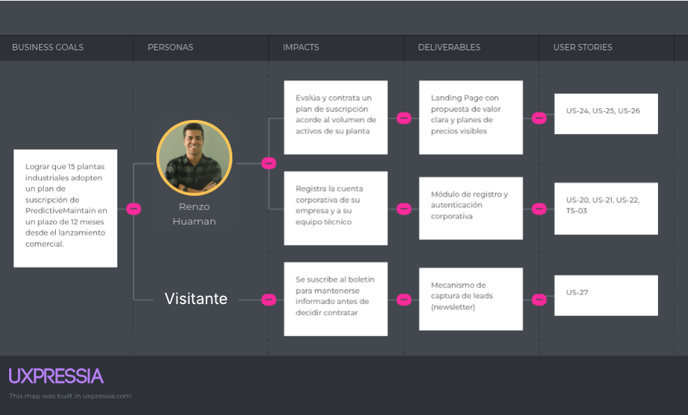
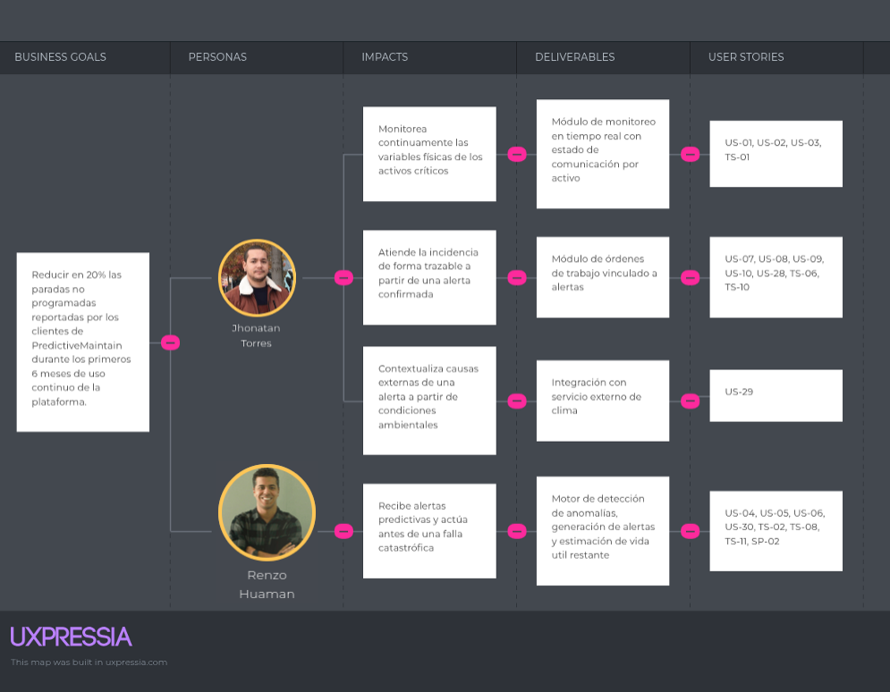
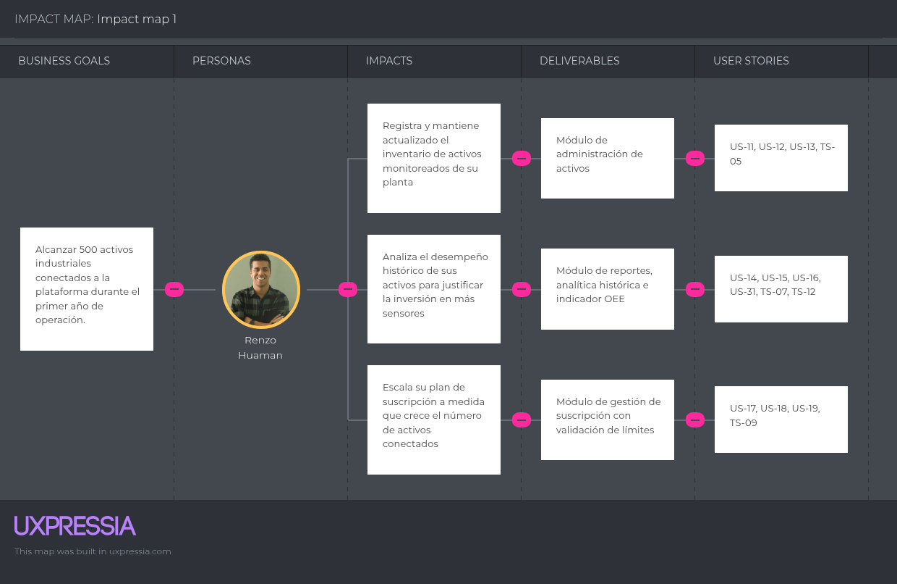

### 2.4.3. Product Backlog

El Product Backlog consolida las User Stories, Technical Stories y Spike Stories identificadas, priorizadas según el valor que aportan al negocio y no según criterios técnicos como la seguridad o autenticación. Conforme a lo indicado en el enunciado, las historias relacionadas con el Landing Page se consideran desde el primer Sprint, dado que la propuesta de valor y los planes de suscripción deben estar disponibles públicamente desde etapas tempranas del proyecto para iniciar la captación de clientes. Le siguen las funcionalidades núcleo del negocio (monitoreo en tiempo real y registro de activos), luego el motor de alertas predictivas y órdenes de trabajo, y finalmente reportes y gestión de suscripción.

| # Orden | User Story Id | Título | Story Points (1/2/3/5/8) | Sprint |
|---|---|---|---|---|
| 1 | US-24 | Visualizar propuesta de valor de la plataforma | 3 | Sprint 1 |
| 2 | US-25 | Consultar planes y precios de suscripción | 3 | Sprint 1 |
| 3 | US-27 | Suscribirse al boletín informativo | 2 | Sprint 1 |
| 4 | US-26 | Solicitar una demostración del producto | 2 | Sprint 1 |
| 5 | US-20 | Registrar cuenta corporativa | 5 | Sprint 1 |
| 6 | TS-03 | Registro y autenticación de usuarios (JWT) | 5 | Sprint 1 |
| 7 | US-21 | Iniciar sesión en la plataforma | 3 | Sprint 1 |
| 8 | US-22 | Recuperar contraseña | 3 | Sprint 1 |
| 9 | US-11 | Registrar un nuevo activo industrial | 5 | Sprint 1 |
| 10 | TS-05 | CRUD de activos industriales | 8 | Sprint 1 |
| 11 | US-01 | Visualizar variables físicas de un activo en tiempo real | 8 | Sprint 1 |
| 12 | TS-01 | Ingesta de lecturas de sensores IoT | 8 | Sprint 1 |
| 13 | SP-01 | Spike: Integración de broker MQTT | 5 | Sprint 1 |
| 14 | US-02 | Consultar listado de activos y estado de comunicación | 3 | Sprint 1 |
| 15 | US-03 | Configurar umbrales de variables físicas por activo | 5 | Sprint 1 |
| 16 | US-29 | Consultar condiciones climáticas asociadas a la ubicación de un activo | 3 | Sprint 1 |
| 17 | SP-02 | Spike: Librería de detección de anomalías | 5 | Sprint 2 |
| 18 | TS-02 | Evaluación de patrones anómalos y generación de alertas | 8 | Sprint 2 |
| 19 | US-04 | Recibir alerta predictiva de falla incipiente | 8 | Sprint 2 |
| 20 | US-05 | Visualizar detalle diagnóstico de una alerta | 3 | Sprint 2 |
| 21 | TS-08 | Notificaciones push de alertas | 5 | Sprint 2 |
| 22 | US-06 | Configurar destinatarios de notificación de alertas | 3 | Sprint 2 |
| 23 | US-07 | Generar orden de trabajo a partir de una alerta confirmada | 5 | Sprint 2 |
| 24 | TS-06 | CRUD y asignación de órdenes de trabajo | 8 | Sprint 2 |
| 25 | US-08 | Asignar orden de trabajo a un técnico | 3 | Sprint 2 |
| 26 | US-09 | Adjuntar evidencia fotográfica a una orden de trabajo | 5 | Sprint 2 |
| 27 | TS-10 | Carga de evidencia fotográfica de órdenes de trabajo | 5 | Sprint 2 |
| 28 | US-10 | Consultar listado de órdenes de trabajo pendientes | 3 | Sprint 2 |
| 29 | TS-04 | Control de acceso basado en roles | 3 | Sprint 2 |
| 30 | US-23 | Gestionar perfil de usuario | 2 | Sprint 2 |
| 31 | US-28 | Continuar gestión de órdenes de trabajo sin conexión | 8 | Sprint 2 |
| 32 | US-14 | Consultar historial de fallas y disponibilidad de un activo | 5 | Sprint 3 |
| 33 | TS-07 | Cálculo de disponibilidad histórica de activos | 5 | Sprint 3 |
| 34 | US-15 | Generar reporte comparativo de desempeño entre activos | 5 | Sprint 3 |
| 35 | US-16 | Exportar reporte histórico de mantenimiento | 3 | Sprint 3 |
| 36 | US-12 | Editar ficha de un activo existente | 2 | Sprint 3 |
| 37 | US-13 | Dar de baja un activo del monitoreo | 3 | Sprint 3 |
| 38 | US-17 | Actualizar plan de suscripción según volumen de activos | 3 | Sprint 3 |
| 39 | TS-09 | Validación de límite de plan de suscripción | 3 | Sprint 3 |
| 40 | US-18 | Consultar consumo actual de la suscripción | 2 | Sprint 3 |
| 41 | US-19 | Recibir notificación de vencimiento de suscripción | 3 | Sprint 3 |

## 2.5. Strategic-Level Domain-Driven Design

En esta sección se introducen y explican las decisiones de nivel estratégico aplicando Domain-Driven Design (DDD) para descomponer el sistema PredictiveMaintain en subconjuntos con límites naturales o Bounded Contexts.  

### 2.5.1. EventStorming

El equipo organizó una sesión de EventStorming colaborativa (duración: 1.5 horas) para modelar el dominio del problema e identificar el comportamiento del sistema desde la ingesta de telemetría IoT hasta la resolución de intervenciones en planta.  

**Actividades Realizadas en la Sesión:**
1. **Unconstrained Brainstorming:** Identificación de eventos de negocio en tiempo pasado (p. ej., Sensor Reading Ingested, Anomaly Pattern Detected, Alert Generated, Work Order Created, Work Order Completed).
2. **Timeline Enforcement:** Ordenamiento cronológico de los eventos en la línea de tiempo operativa.
3. **Triggers, Commands & Aggregates:** Asociación de cada evento con los comandos desencadenantes (p. ej., Confirm Alert, Assign Work Order), agregados e involucrados.

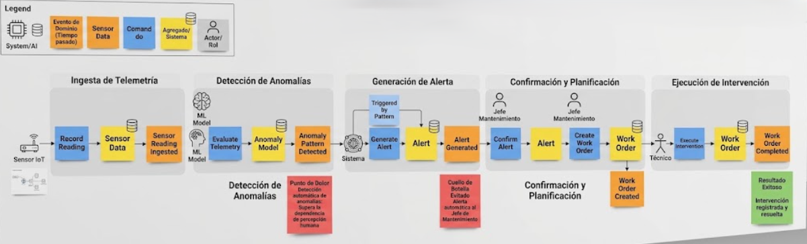

#### 2.5.1.1. Candidate Context Discovery

A partir del mapa de EventStorming, se realizó la sesión de Candidate Context Discovery (duración: 1.5 horas) para descubrir los Bounded Contexts candidatos mediante las técnicas Look-for-pivotal-events (cambios de estado clave) y Start-with-value (aislamiento del core predictivo):
- **Asset Telemetry & Analytics Context (Core):** Agrupa la ingesta de lecturas IoT, detección de anomalías por Machine Learning y cálculo de indicadores (RUL y OEE).
- **Maintenance Operations Context (Supporting):** Administra el inventario de activos, ciclo de vida de alertas, órdenes de trabajo y gestión offline.
- **Subscription & Billing Context (Generic):** Controla las cuentas corporativas, planes de suscripción y límites de activos.
- **Identity & Access Management Context (Generic):** Gestiona usuarios, autenticación mediante JWT y autorización RBAC.

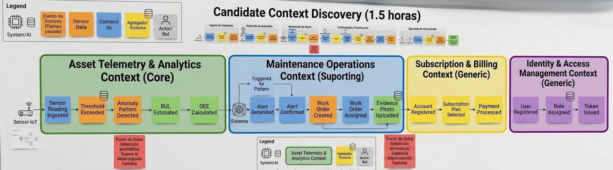

#### 2.5.1.2. Domain Message Flows Modeling

Para visualizar cómo colaboran los Bounded Contexts frente a escenarios reales del negocio, aplicamos la técnica de Domain Storytelling.  

**Historia de Negocio: Detección y Atención de Falla Predictiva**
1. El ***Sensor IoT*** transmite lecturas físicas al **Asset Telemetry & Analytics Context.**
2. El ***Modelo Predictivo*** detecta un patrón anómalo y emite el evento *Anomaly Pattern Detected.*
3. El **Maintenance Operations Context** consume el evento, genera una *Alert* y notifica al ***Jefe de Mantenimiento***.
4. El ***Jefe de Mantenimiento*** confirma la alerta y emite el comando para crear la *Work Order*.
5. El ***Técnico de Mantenimiento*** atiende la orden en la app móvil (soporte offline), carga la evidencia fotográfica y completa la intervención.

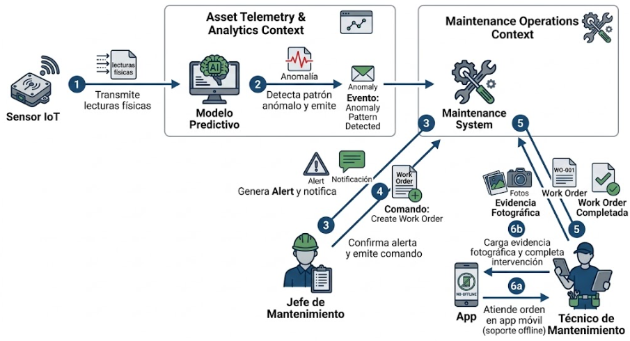

#### 2.5.1.3. Bounded Context Canvases

Siguiendo el proceso iterativo de diseño (Context Overview Definition, Business Rules Distillation, Capability Analysis y Dependencies Capture), elaboramos los canvases para todos los Bounded Contexts del sistema:  

**1. Bounded Context Canvas: Asset Telemetry & Analytics**
   - **Strategic Classification:** Core Domain.
   - **Domain Roles:** Ingesta masiva de datos IoT en tiempo real, inferencia predictiva de fallas incipientes, estimación de Vida Útil Restante (RUL) y cálculo de la Eficiencia General de los Equipos (OEE).
   - **Ubiquitous Language:** Sensor Reading, Threshold, Anomaly Pattern, RUL, OEE, Time-Series Data.
   - **Inbound Events:** Sensor Reading Ingested.
   - **Outbound Events:** Anomaly Pattern Detected, Threshold Exceeded.

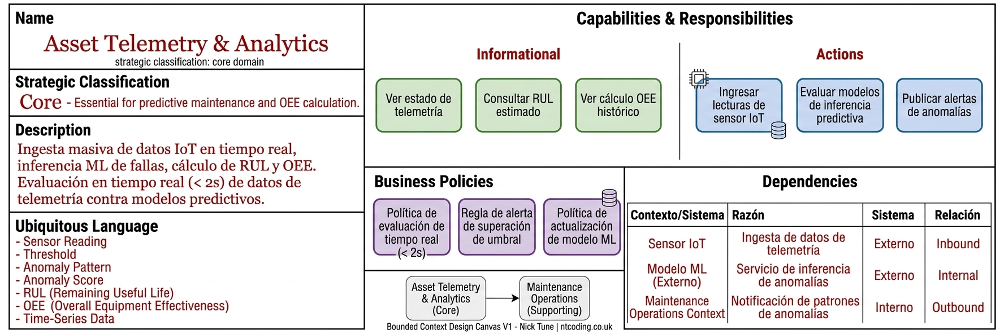
     
**2. Bounded Context Canvas: Maintenance Operations**
   - **Strategic Classification:** Supporting Domain.
   - **Domain Roles:** Control del inventario de activos, generación y flujo de alertas, gestión y seguimiento de órdenes de trabajo, captura de evidencias y sincronización offline en la app móvil.
   - **Ubiquitous Language:** Asset, Alert, Severity Level, Work Order, Unplanned Downtime, Offline Sync, Evidence Photo.
   - **Inbound Events:** Anomaly Pattern Detected.
   - **Outbound Events:** Alert Confirmed, Work Order Created, Work Order Assigned, Work Order Completed.

     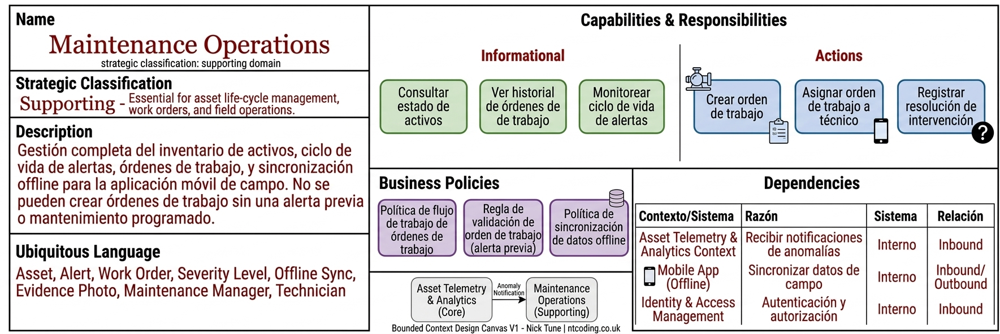

**3. Bounded Context Canvas: Subscription & Billing**
   - **Strategic Classification:** Generic Domain.
   - **Domain Roles:** Registro de clientes corporativos, gestión de suscripciones (Planes Basic, Pro, Enterprise), facturación y control de límites operacionales por cuenta.
   - **Ubiquitous Language:** Tenant/Company, Subscription Plan, Asset Limit, Billing Cycle, Invoice.
   - **Inbound Events:** None.
   - **Outbound Events:** Subscription Created, Subscription Limit Exceeded, Payment Processed.

     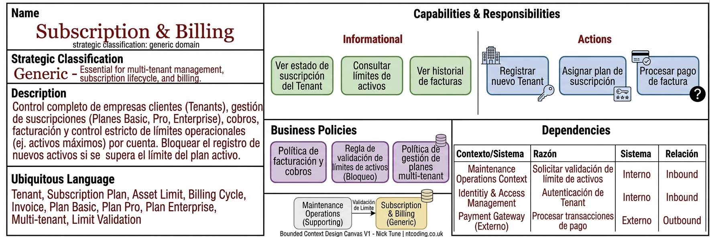
     
**4. Bounded Context Canvas: Identity & Access Management**
   - **Strategic Classification:** Generic Domain.
   - **Domain Roles:** Autenticación de usuarios, emisión de tokens JWT, gestión de credenciales y autorización basada en roles (RBAC).
   - **Ubiquitous Language:** User Account, Credentials, JWT Token, Role (Maintenance Manager, Technician), Permission.
   - **Inbound Events:** None.
   - **Outbound Events:** User Authenticated, User Registered.

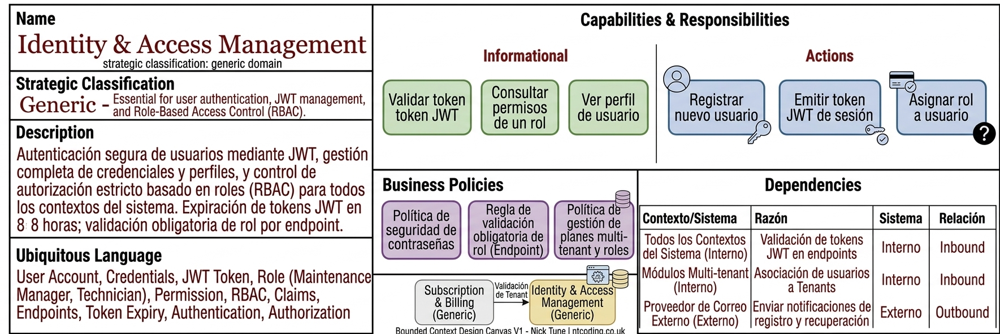

### 2.5.2. Context Mapping

El equipo evaluó diversos escenarios candidatos mediante el planteamiento de preguntas clave sobre la distribución de responsabilidades y límites del sistema:

**1. Aislamiento del Core Domain**

- **Pregunta:** *«¿Qué pasaría si aislando el motor predictivo reducida la dependencia técnica con la gestión de órdenes de trabajo?»*
- **Análisis:** Se identificó que la telemetría e IA procesan alto volumen de eventos en tiempo real, mientras que la gestión de órdenes es transaccional y orientada a procesos humanos.
- **Decisión:** Separar Asset Telemetry & Analytics Context de Maintenance Operations Context, comunicándolos de forma asíncrona mediante un patrón Publisher / Subscriber y una ACL.

**2. Evaluación de Servicios Compartidos (Shared Services)**

- **Pregunta:** *«¿Qué pasaría si tomamos las capacidades de gestión de usuarios y autenticación de todos los contextos y formamos un Bounded Context independiente?»*
- **Análisis:** Inicialmente se consideró que cada contexto gestione sus propios roles, pero esto generaba duplicación de lógica y brechas de seguridad.
- **Decisión:** Crear un Identity & Access Management Context centralizado que actúe como Upstream (OHS/PL) para el resto del sistema.

**3. Control de Límites Comerciales y Monetización**

- **Pregunta:** *«¿Qué pasaría si duplicamos la lógica de verificación de planes e inscripciones dentro de Mantenimiento para romper la dependencia con Facturación?»*

- **Análisis:** Duplicar las reglas de negocio de los planes de suscripción crearía inconsistencias cuando se modifiquen las tarifas o límites comerciales.

- **Decisión:** Mantener la responsabilidad en Subscription & Billing Context y establecer una relación Customer / Supplier con Maintenance Operations Context.

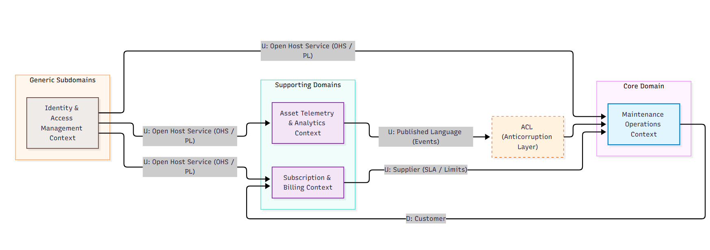

- ***Asset Telemetry & Analytics (U) => Maintenance Operations (D):*** Telemetría expone eventos como proveedor **Upstream (U)** usando un protocolo de publicación (Published Language). El contexto de Mantenimiento **(Downstream - D)** implementa una **ACL (Anticorruption Layer)** propia para desacoplar las estructuras de datos de la telemetría respecto al modelo interno de órdenes de trabajo.
- ***Maintenance Operations (Customer) <=> Subscription & Billing (Supplier):*** Relación **Customer / Supplier (C/S)** donde Mantenimiento depende de las validaciones de planes comerciales antes de habilitar registros, y Facturación adapta sus SLA/contratos a los requerimientos operativos.
- ***Identity & Access Management (U) => Todos (D):*** Actúa como subdominio genérico publicando una interfaz estándar **OHS / PL (Open Host Service / Published Language)** mediante tokens JWT/OAuth2 para todo el sistema.

### 2.5.3. Software Architecture

Se presenta la representación de la arquitectura de software de **PredictiveMaintain** aplicando el estándar **C4 Model** a nivel de contexto y contenedores.

#### 2.5.3.1. Software Architecture Context Level Diagrams

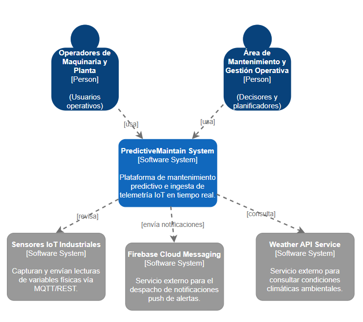

#### 2.5.3.2. Software Architecture Container Level Diagrams

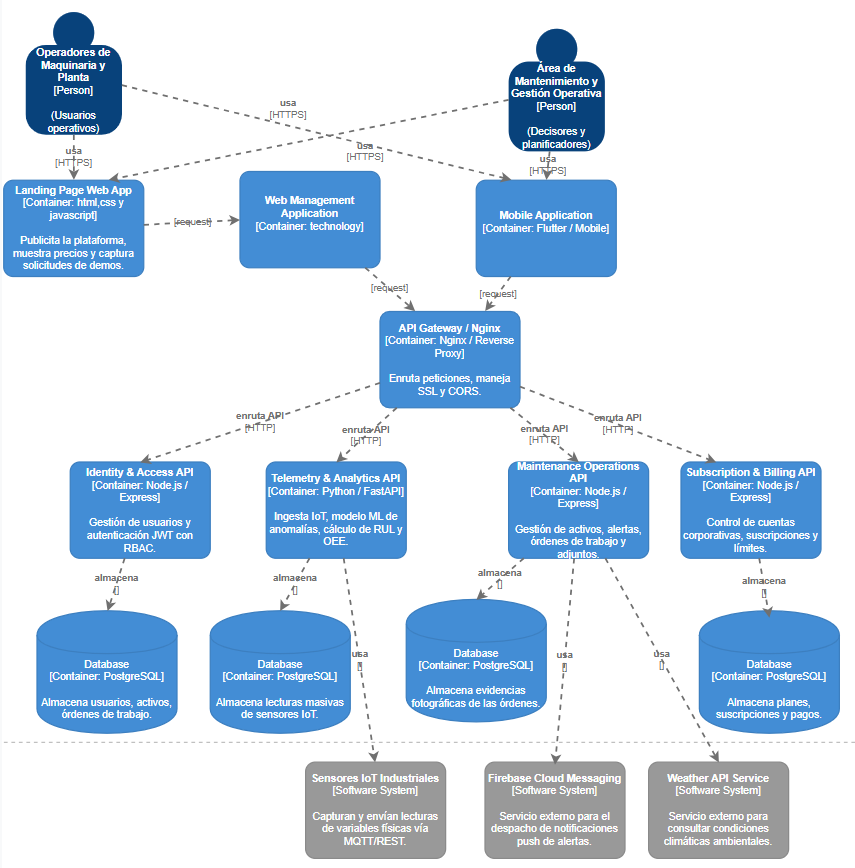

#### 2.5.3.3. Software Architecture Deployment Diagrams

El despliegue propuesto para PredictiveMaintain distribuye la solución entre los dispositivos de los usuarios, un alojamiento web, un servidor de aplicaciones y un servidor PostgreSQL. La aplicación móvil se ejecuta con Flutter y Dart, mientras que el acceso al backend se centraliza mediante Nginx. Los cuatro bounded contexts se exponen como APIs desarrolladas con NestJS y TypeScript.

**Alcance del informe.** Los modelos de esta sección corresponden a una propuesta de diseño. El repositorio contiene documentación y diagramas, pero todavía no contiene código de aplicación ni evidencia de infraestructura desplegada. Por ello, las clases, endpoints y tablas siguientes representan el diseño que guiará la implementación.

La elección de NestJS ajusta la propuesta a las tecnologías admitidas en la consigna del curso (sección Tecnología, p. 33). Requiere actualizar el diagrama de contenedores de 2.5.3.2, que actualmente indica Express y FastAPI. Se conservan los cuatro contextos, Flutter, Nginx y PostgreSQL definidos por el equipo. El uso de un motor predictivo especializado queda encapsulado como una futura integración de analítica.

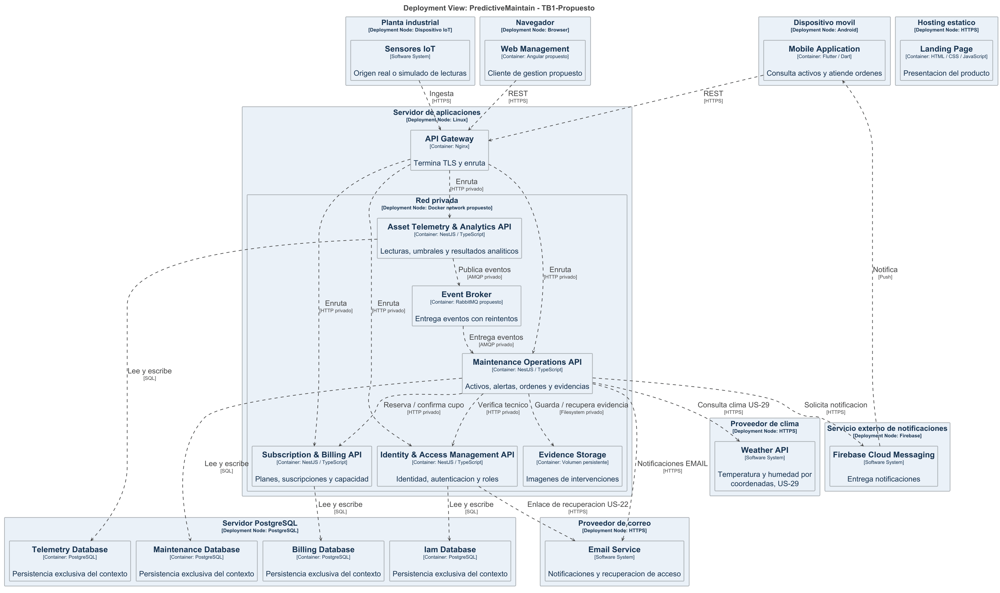

*Figura 1. Despliegue propuesto de PredictiveMaintain para el entorno académico. Elaboración propia a partir del modelo del proyecto. Fuente editable: [Structurizr DSL](diagramas/workspace.dsl), vista despliegue.*

| Nodo | Contenedores o artefactos | Responsabilidad |
| --- | --- | --- |
| Dispositivo móvil | Mobile Application, Flutter/Dart | Consulta de activos y alertas, atención de órdenes y captura de evidencias. |
| Navegador y alojamiento web | Web Management, Angular propuesto; Landing Page, HTML/CSS/JavaScript | La landing presenta el producto. El cliente de gestión se entrega como archivos web y se ejecuta en el navegador. |
| Servidor de aplicaciones | Nginx, cuatro APIs NestJS, RabbitMQ y volumen de evidencias | Expone HTTPS, ejecuta casos de uso, distribuye eventos y conserva archivos. |
| Servidor de datos | Cuatro bases lógicas PostgreSQL | Aísla la persistencia de telemetría, mantenimiento, suscripciones e identidad. |
| Sistemas externos | Sensores IoT, Firebase Cloud Messaging, Weather API y servicio de correo | Emiten mediciones, entregan notificaciones, consultan clima y envían enlaces de recuperación. |

Los clientes utilizan HTTPS para acceder a Nginx. Las APIs, el broker y PostgreSQL permanecen en una red privada; los clientes no consultan las bases directamente. Para la demostración se propone una única instancia por API y un servidor de datos separado. Esta distribución permite explicar los límites del sistema, pero no ofrece alta disponibilidad: la falla del servidor de aplicaciones interrumpe el servicio.

La ingesta inicial se plantea mediante REST sobre HTTPS. La adopción de MQTT requeriría incorporar su broker y adaptador de ingesta. RabbitMQ se utiliza aquí para los eventos de negocio entre contextos, no como sustituto implícito de un broker MQTT. El patrón outbox permite registrar el evento junto con la detección en PostgreSQL y publicarlo posteriormente; el consumidor identifica reenvíos por eventId.

Las fotografías se guardan en un volumen persistente con claves opacas; PostgreSQL conserva sus metadatos y asociación con la orden. El acceso al archivo requiere autorización de la API. Para el modo offline, Flutter mantendrá una cola local de operaciones y archivos pendientes. La base local y la política de cifrado se definirán al implementar; una operación no se considera sincronizada hasta que el servidor la acepta.

La consulta de Weather API está justificada por US-29 en la rama sebastian. Maintenance Operations solicita temperatura y humedad para las coordenadas del activo. Si el proveedor falla, devuelve el estado «información climática no disponible» y mantiene operativa la ficha. El servicio de correo soporta la recuperación de contraseña y las notificaciones por correo previstas en US-06 y US-22. Los proveedores, dominios, versiones, copias de seguridad y credenciales se concretarán cuando el equipo configure el entorno.

## 2.6. Tactical-Level Domain-Driven Design

La representación C4 sigue la separación entre contenedores y componentes descrita por Structurizr (s. f.); la notación de clases utiliza visibilidad y multiplicidades de PlantUML (s. f.).

El diseño táctico desarrolla los cuatro bounded contexts identificados en 2.5.1.1. La revisión incluye las ramas main, choy, sebastian y Valverde. Las historias US y TS referenciadas proceden de sebastian; el diseño estratégico procede de Valverde. Las ramas contienen aportes complementarios que aún deben integrarse por el equipo. Cada contexto mantiene su lenguaje, reglas y persistencia. Las entidades poseen identidad propia; los value objects representan valores inmutables; las raíces de agregado controlan las modificaciones de las entidades que contienen.

Las capas se organizan de la siguiente manera: Interface recibe peticiones o eventos; Application coordina los casos de uso; Domain contiene las reglas y contratos; Infrastructure implementa persistencia e integraciones. El dominio no depende de NestJS, PostgreSQL o RabbitMQ. Las interfaces de repositorio pertenecen al dominio y sus adaptadores a infraestructura.

**Criterios comunes del modelo**

- Cada operación de negocio se restringe a una empresa mediante tenantId. Los identificadores UUID de otro contexto son referencias lógicas; no se crean claves foráneas entre bases independientes.
- Las claves foráneas locales incluyen tenantId cuando relacionan registros empresariales, evitando asociaciones entre empresas distintas.
- Se utilizan instantes con zona horaria (timestamptz), tipos decimales para importes y mediciones, e identificadores UUID. Los campos con «?» son opcionales; los demás son obligatorios.
- Los DTOs de salida no exponen entidades completas ni credenciales. Los errores distinguen datos inválidos, falta de permiso, recurso inexistente y conflicto de estado o versión.
- Los diagramas C4 descomponen cada API en componentes. Los diagramas UML describen las clases propuestas y los modelos de datos presentan su persistencia. No constituyen evidencia de clases ya programadas.

| Sección | Bounded context | Tipo estratégico | Responsabilidad |
| --- | --- | --- | --- |
| 2.6.1 | Asset Telemetry & Analytics | Core | Lecturas, umbrales y resultados analíticos. |
| 2.6.2 | Maintenance Operations | Supporting | Activos, alertas, órdenes y evidencias. |
| 2.6.3 | Subscription & Billing | Generic | Empresa, plan, suscripción y capacidad. |
| 2.6.4 | Identity & Access Management | Generic | Identidad, autenticación y roles. |

### 2.6.1. Bounded Context: Asset Telemetry & Analytics

Recibe mediciones de los sensores asociados a activos industriales, evalúa umbrales y conserva resultados analíticos trazables. Es el core domain identificado en el diseño estratégico.

#### 2.6.1.1. Domain Layer

La capa de dominio define las siguientes clases. Los atributos se presentan con su tipo y finalidad; los métodos representan comportamiento del modelo, no operaciones CRUD genéricas.

**Sensor — Aggregate Root.** Define la procedencia y unidad de una serie de mediciones.

| Atributo | Tipo | Descripción |
| --- | --- | --- |
| id | uuid | Identificador del sensor |
| tenant_id | uuid | Empresa propietaria |
| asset_id | uuid | Referencia externa al activo de mantenimiento |
| metric | varchar(40) | Magnitud observada |
| unit | varchar(20) | Unidad de medida |
| active | boolean | Habilitación de ingesta |
| last_received_at | timestamptz? | Última recepción para evaluar comunicación |

Métodos: `deactivate(): void`; `accepts(unit: string): boolean`.

**SensorReading — Aggregate Root.** Medición inmutable para evaluar la condición del equipo.

| Atributo | Tipo | Descripción |
| --- | --- | --- |
| id | uuid | Identificador de lectura |
| tenant_id | uuid | Empresa de origen |
| sensor_id | uuid | Sensor que la emite |
| source_key | varchar(100) | Clave idempotente del dispositivo |
| value | numeric | Valor medido |
| unit | varchar(20) | Unidad de origen |
| measured_at | timestamptz | Instante de medición |
| received_at | timestamptz | Instante de recepción |

Métodos: `create(sensor: Sensor, measurement: Measurement): SensorReading`.

**ThresholdRule — Aggregate Root.** Intervalo permitido para un sensor, modificable por el jefe de mantenimiento.

| Atributo | Tipo | Descripción |
| --- | --- | --- |
| id | uuid | Identificador de regla |
| tenant_id | uuid | Empresa |
| sensor_id | uuid | Sensor evaluado |
| lower_bound | numeric | Límite inferior |
| upper_bound | numeric | Límite superior |
| severity | varchar(20) | WARNING o CRITICAL |
| version | integer | Versión de la regla |

Métodos: `evaluate(value: decimal): boolean`; `changeBounds(lower: decimal, upper: decimal): void`.

**AnomalyDetection — Aggregate Root.** Resultado de una evaluación que excede un intervalo.

| Atributo | Tipo | Descripción |
| --- | --- | --- |
| id | uuid | Identificador de detección |
| tenant_id | uuid | Empresa |
| reading_id | uuid | Lectura que origina la detección |
| rule_id | uuid | Regla usada |
| rule_version | integer | Versión aplicada |
| lower_snapshot | numeric | Límite inferior aplicado |
| upper_snapshot | numeric | Límite superior aplicado |
| severity | varchar(20) | Nivel de atención |
| detected_at | timestamptz | Instante de detección |

Métodos: `fromThreshold(reading: SensorReading, rule: ThresholdRule): AnomalyDetection`.

**RulEstimate — Aggregate Root.** Estimación futura de vida útil; no se genera sin un modelo validado.

| Atributo | Tipo | Descripción |
| --- | --- | --- |
| id | uuid | Identificador |
| tenant_id | uuid | Empresa |
| asset_id | uuid | Referencia externa al activo |
| hours_remaining | numeric | Horas restantes estimadas |
| model_version | varchar(80) | Versión del modelo |
| estimated_at | timestamptz | Instante de inferencia |
| confidence | numeric | Confianza de la estimación entre 0 y 1 |

Métodos: `create(hours: decimal, modelVersion: string): RulEstimate`.

**Value objects y tipos de dominio**

| Tipo | Miembros | Propósito |
| --- | --- | --- |
| Measurement | value: decimal; unit: string. of(value, unit): Measurement | Agrupa valor finito y unidad no vacía; es inmutable. |

**Contrato de persistencia.** `ITelemetryRepository` representa los puertos de recuperación y persistencia del contexto: `findById(tenantId, id)` y `save(aggregate)`. El tipo Aggregate en el diagrama es una abreviatura de las raíces del contexto, no una tabla ni una clase adicional. En la implementación se separarán los repositorios por raíz cuando sus operaciones lo requieran.

**Reglas de negocio**

1. Una lectura corresponde a un sensor activo de la misma empresa. Su magnitud y unidad deben coincidir con la configuración del sensor; no se comparan valores de unidades distintas.
2. El identificador de origen de cada lectura es único por sensor. Reenviar una medición devuelve el resultado previo y no produce una nueva anomalía.
3. Una regla tiene límite inferior menor que el superior. Un valor igual al límite permanece dentro del intervalo permitido; un valor exterior genera una detección.
4. La detección por umbrales es una capacidad inicial propuesta, distinta de un modelo predictivo entrenado. RUL se presenta como no disponible mientras no exista un modelo y datos suficientes; nunca se sustituye por cero.
5. Una estimación de RUL debe registrar horas restantes no negativas, instante y versión del modelo. OEE requiere disponibilidad, rendimiento y calidad en una misma ventana temporal; no se deriva solo de temperatura o vibración.
6. La persistencia de la detección y de su evento de salida se realiza en una misma transacción. La entrega al contexto de mantenimiento admite reintentos e identificación de duplicados.

#### 2.6.1.2. Interface Layer

Los controladores REST validan los recursos de entrada y delegan los casos de uso. Los permisos se verifican junto con la pertenencia del recurso a la empresa autenticada. Las rutas internas no son accesibles al cliente móvil.

| Endpoint propuesto | Recurso o contenido | Acceso |
| --- | --- | --- |
| POST /api/sensors/readings | IngestReadingResource: sensorId, sourceKey, value, unit, measuredAt | Credencial de dispositivo vinculada al sensor |
| PUT /api/sensors/{id}/threshold | ConfigureThresholdResource: lower, upper, severity | MaintenanceManager |
| GET /api/assets/{id}/readings | ReadingsQuery: from, to, cursor, limit | MaintenanceManager, Technician, Operator |
| GET /api/assets/{id}/analytics | AnalyticsResource: detections, rulHours nullable, modelVersion nullable | MaintenanceManager |

`TelemetryControllers` agrupa los controladores de estas rutas. Cada operación recibe el DTO indicado y devuelve un recurso explícito con identificador y estado. Las consultas de colecciones usan paginación.

**Trazabilidad con sebastian.** US-01/02 se apoyan en last_received_at: más de cinco minutos sin recepción implica «sin comunicación». US-30 y TS-11 requieren `GET /api/assets/{id}/rul`, con horas restantes y confianza; si falta historial se devuelve estimación no disponible. TS-02 define `POST /api/alerts/evaluate`: el gateway lo dirige al evaluador de telemetría aunque la consulta y el estado operativo de alertas pertenecen a Maintenance.

TS-01 requiere 429 ante lecturas repetidas dentro del intervalo mínimo. Ese límite de admisión se aplica antes de persistir, mientras la unicidad de sourceKey evita duplicar registros. El intervalo mínimo y su configuración deben definirse con el equipo. La arquitectura prevé IPredictiveModel y su adaptador para la evaluación de patrones; no se atribuye un modelo entrenado al informe.

#### 2.6.1.3. Application Layer

| Clase | Responsabilidad |
| --- | --- |
| IngestReadingHandler | Registra o recupera una lectura por su clave idempotente. |
| EvaluateReadingHandler | Evalúa reglas, crea detección y evento en una transacción. |
| ConfigureThresholdHandler | Valida límites y actualiza la versión de la regla. |
| GetAssetAnalyticsHandler | Consulta resultados e informa RUL no disponible cuando falta una estimación. |

**Flujo principal.** IngestReadingHandler valida sensor, empresa y unidad; guarda la lectura; EvaluateReadingHandler selecciona la regla, evalúa el valor y registra AnomalyDetection. Si corresponde, añade ThresholdExceeded a la outbox. Un publicador entrega ese evento a Maintenance Operations.

#### 2.6.1.4. Infrastructure Layer

PostgresTelemetryRepository persiste sensores, lecturas y resultados; OutboxPublisher publica en RabbitMQ; DeviceCredentialVerifier valida credenciales de ingesta. PredictiveModelAdapter queda como extensión futura, sin modelo entrenado atribuido al equipo.

Los adaptadores implementan los contratos requeridos por Application y Domain. Los repositorios aplican filtros por empresa y la transacción abarca las modificaciones que deben confirmarse juntas. Un error de persistencia no se traduce en una operación completada.

#### 2.6.1.5. Bounded Context Software Architecture Component Level Diagrams

El contenedor Asset Telemetry & Analytics API se descompone en controladores, handlers, modelo de dominio y adaptadores de infraestructura. Los controladores llaman a los handlers; estos coordinan las reglas y utilizan contratos de persistencia. Los adaptadores conocen PostgreSQL, mientras el modelo de dominio permanece independiente.

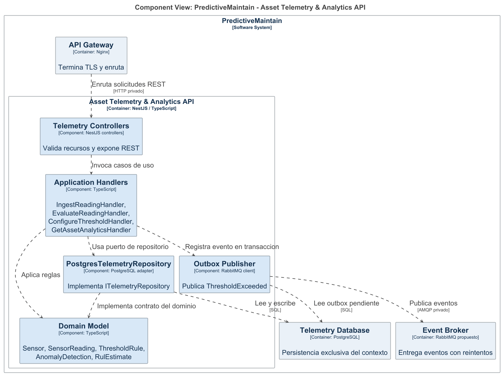

*Figura 2. Componentes de Asset Telemetry & Analytics. Elaboración propia. Fuente: [Structurizr DSL](diagramas/workspace.dsl), vista telemetry-componentes.*

#### 2.6.1.6. Bounded Context Software Architecture Code Level Diagrams

Los modelos siguientes relacionan las clases de dominio con su representación persistente. La separación permite cambiar los adaptadores sin trasladar reglas de negocio a los controladores.

##### 2.6.1.6.1. Bounded Context Domain Layer Class Diagrams

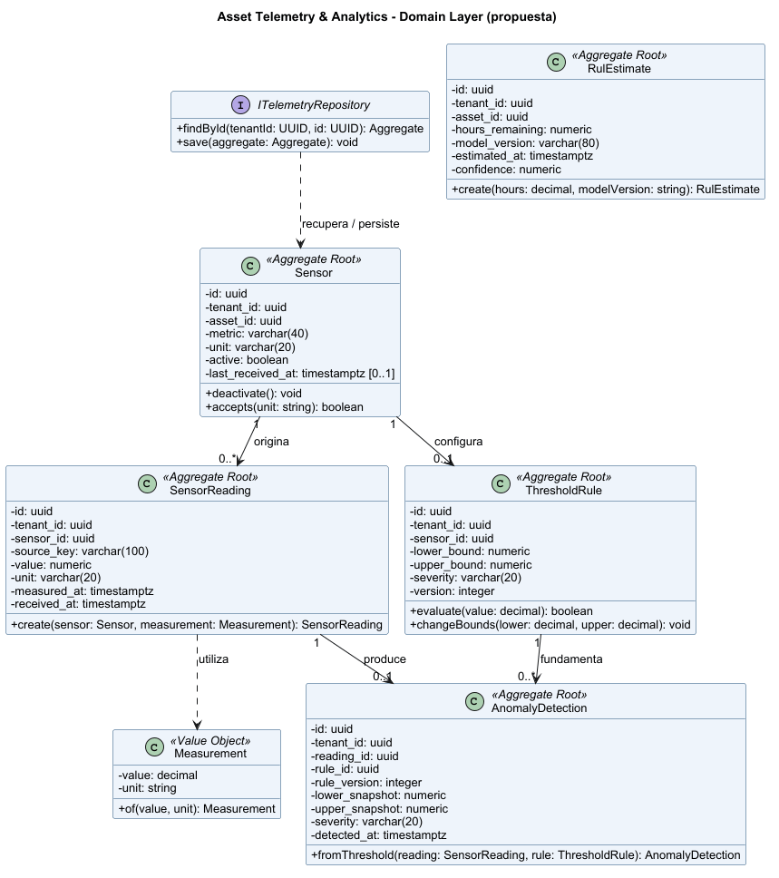

*Figura 3. Diagrama UML de dominio de Asset Telemetry & Analytics. Elaboración propia. [Fuente PlantUML](diagramas/telemetry-clases.puml).*

Las relaciones del modelo son: Sensor (1) → SensorReading (0..*), origina; Sensor (1) → ThresholdRule (0..1), configura; SensorReading (1) → AnomalyDetection (0..1), produce; ThresholdRule (1) → AnomalyDetection (0..*), fundamenta. El signo «−» indica atributos privados y «+», operaciones públicas. Los value objects no requieren una tabla propia cuando sus valores se almacenan en la entidad propietaria.

##### 2.6.1.6.2. Bounded Context Database Design Diagram

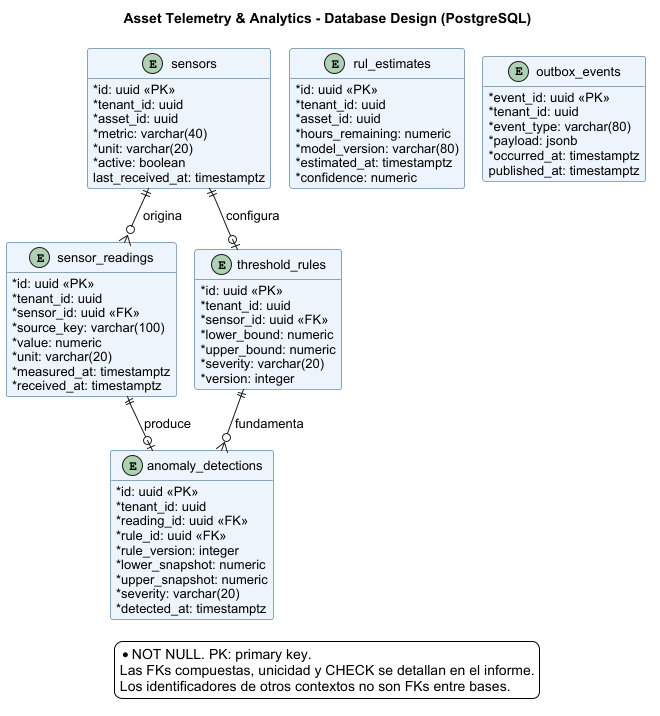

*Figura 4. Modelo relacional de Asset Telemetry & Analytics. Elaboración propia. [Fuente editable](diagramas/telemetry-database.puml).*

**Diccionario de persistencia.** Cada clase persistente corresponde a la tabla siguiente. Las columnas y tipos son los documentados en Domain Layer y visibles en el diagrama. Los atributos opcionales permiten NULL.

| Clase | Tabla PostgreSQL |
| --- | --- |
| Sensor | sensors |
| SensorReading | sensor_readings |
| ThresholdRule | threshold_rules |
| AnomalyDetection | anomaly_detections |
| RulEstimate | rul_estimates |

**Claves, restricciones e índices**

- sensors: last_received_at puede ser NULL mientras no haya recepciones; PK(id); UNIQUE(tenant_id, id). asset_id referencia a Maintenance sin FK entre bases.
- sensor_readings: PK(id); UNIQUE(tenant_id, id); UNIQUE(tenant_id, sensor_id, source_key); FK(tenant_id, sensor_id) a sensors(tenant_id, id).
- threshold_rules: PK(id); UNIQUE(tenant_id, id); UNIQUE(tenant_id, sensor_id); FK(tenant_id, sensor_id) a sensors; CHECK(lower_bound < upper_bound), CHECK(version > 0).
- anomaly_detections: PK(id); UNIQUE(tenant_id, reading_id); FKs compuestas por tenant_id hacia sensor_readings y threshold_rules. Se conservan versión y límites aplicados aunque luego cambie la regla.
- rul_estimates: PK(id); CHECK(hours_remaining >= 0); CHECK(confidence BETWEEN 0 AND 1); asset_id es referencia externa. Índice(tenant_id, asset_id, estimated_at).
- Índice de consulta de lecturas: (tenant_id, sensor_id, measured_at). severity acepta WARNING o CRITICAL. La finitud de numeric se valida antes de persistir.

**Tabla técnica adicional:** `outbox_events(event_id UUID PK, tenant_id UUID NOT NULL, event_type VARCHAR(80) NOT NULL, payload JSONB NOT NULL, occurred_at TIMESTAMPTZ NOT NULL, published_at TIMESTAMPTZ NULL)`. Se crea en la misma transacción que la detección. El contrato ThresholdExceeded incluye eventId, tenantId, assetId, sensorId, detectionId, severity y occurredAt. No es una entidad de dominio.

### 2.6.2. Bounded Context: Maintenance Operations

Gestiona activos, alertas y órdenes de trabajo. Traduce eventos de telemetría al lenguaje operativo de la planta mediante una Anticorruption Layer.

#### 2.6.2.1. Domain Layer

La capa de dominio define las siguientes clases. Los atributos se presentan con su tipo y finalidad; los métodos representan comportamiento del modelo, no operaciones CRUD genéricas.

**Asset — Aggregate Root.** Equipo industrial inventariado.

| Atributo | Tipo | Descripción |
| --- | --- | --- |
| id | uuid | Identificador del activo |
| tenant_id | uuid | Empresa |
| code | varchar(50) | Código interno |
| name | varchar(120) | Nombre del equipo |
| location | varchar(120) | Ubicación |
| active | boolean | Estado de uso |
| capacity_reservation_id | uuid | Reserva externa de capacidad |
| plant_id | uuid | Planta de operación |
| production_line | varchar(100) | Línea de producción |
| asset_type | varchar(80) | Tipo de equipo |
| criticality | varchar(20) | Criticidad del activo |
| latitude | numeric? | Latitud para US-29 |
| longitude | numeric? | Longitud para US-29 |

Métodos: `register(code: string, name: string): Asset`; `deactivate(): void`.

**Alert — Aggregate Root.** Advertencia operativa originada en una detección.

| Atributo | Tipo | Descripción |
| --- | --- | --- |
| id | uuid | Identificador |
| tenant_id | uuid | Empresa |
| asset_id | uuid | Activo afectado |
| source_event_id | uuid | Evento externo único |
| severity | varchar(20) | WARNING o CRITICAL |
| status | varchar(20) | IN_REVIEW, CONFIRMED, DISCARDED o RESOLVED |
| created_at | timestamptz | Fecha de creación |
| version | integer | Versión de concurrencia |
| discard_reason | text? | Motivo obligatorio al descartar |
| updated_at | timestamptz | Última modificación |

Métodos: `confirm(): void`; `resolve(): void`; `discard(reason: string): void`.

**WorkOrder — Aggregate Root.** Intervención de mantenimiento sobre una alerta confirmada.

| Atributo | Tipo | Descripción |
| --- | --- | --- |
| id | uuid | Identificador |
| tenant_id | uuid | Empresa |
| alert_id | uuid | Alerta que justifica la orden |
| assigned_user_id | uuid? | Referencia externa al técnico |
| status | varchar(20) | Estado de la intervención |
| summary | text? | Resumen al completar |
| created_at | timestamptz | Fecha de apertura |
| completed_at | timestamptz? | Fecha de cierre |
| version | integer | Versión de concurrencia |
| updated_at | timestamptz | Marca de tiempo del cambio aceptado |

Métodos: `assign(technicianId: UUID): void`; `start(): void`; `complete(summary: string): void`; `cancel(): void`.

**EvidencePhoto — Entity.** Archivo vinculado a una orden, gestionado mediante su agregado.

| Atributo | Tipo | Descripción |
| --- | --- | --- |
| id | uuid | Identificador |
| tenant_id | uuid | Empresa |
| work_order_id | uuid | Orden propietaria |
| storage_key | varchar(255) | Ruta interna opaca |
| mime_type | varchar(80) | Tipo de imagen validado |
| uploaded_at | timestamptz | Fecha de recepción |

Métodos: `create(storageKey: string, mimeType: string): EvidencePhoto`.

**WorkOrderChange — Entity.** Registro inmutable de cambios de estado o asignación de una orden.

| Atributo | Tipo | Descripción |
| --- | --- | --- |
| id | uuid | Identificador |
| tenant_id | uuid | Empresa |
| work_order_id | uuid | Orden propietaria |
| actor_id | uuid | Usuario responsable |
| previous_status | varchar(20) | Estado previo |
| new_status | varchar(20) | Estado aceptado |
| previous_assignee_id | uuid? | Técnico anterior |
| new_assignee_id | uuid? | Nuevo técnico |
| changed_at | timestamptz | Fecha del cambio |

Métodos: `record(actorId: UUID, changedAt: DateTime): WorkOrderChange`.

**Value objects y tipos de dominio**

| Tipo | Miembros | Propósito |
| --- | --- | --- |
| WorkOrderStatus | OPEN; ASSIGNED; IN_PROGRESS; COMPLETED; CANCELLED.  | Enumeración de estados; las transiciones se controlan en WorkOrder. |

**Contrato de persistencia.** `IMaintenanceRepository` representa los puertos de recuperación y persistencia del contexto: `findById(tenantId, id)` y `save(aggregate)`. El tipo Aggregate en el diagrama es una abreviatura de las raíces del contexto, no una tabla ni una clase adicional. En la implementación se separarán los repositorios por raíz cuando sus operaciones lo requieran.

**Reglas de negocio**

1. Cada activo pertenece a una empresa y su código es único dentro de ella. Su alta requiere una reserva de capacidad aprobada por Subscription & Billing.
2. Un evento de anomalía genera como máximo una alerta. Una alerta puede originar como máximo una orden de trabajo.
3. La creación de la alerta es automática. El jefe revisa y confirma la alerta; el técnico puede crear la orden a partir de una alerta ya confirmada (US-07 y TS-06). Confirmar una alerta y crear una orden son operaciones separadas. Descartar una alerta exige motivo y no permite crear una orden desde ella (US-04).
4. Una orden pasa de OPEN a ASSIGNED, después IN_PROGRESS y finalmente COMPLETED. Solo puede cancelarse desde OPEN o ASSIGNED. No se reabre una orden completada.
5. La asignación exige un técnico activo de la misma empresa. El técnico solo modifica sus órdenes; el operador consulta activos y alertas sin asignar ni cerrar órdenes.
6. Completar una orden exige registrar las acciones correctivas realizadas (US-07 y TS-06). US-09 permite adjuntar fotografías; no establece que una fotografía sea requisito obligatorio de cierre. El cierre de la orden y la resolución de su alerta son atómicos.
7. Las modificaciones offline llevan operationId, expectedVersion y modifiedAt. Según US-28, ante conflictos se prioriza la modificación más reciente y se notifica al técnico. El servidor conserva ambas versiones en el historial y aplica las reglas de estado y permisos antes de aceptar el cambio; una transición inválida devuelve conflicto para conciliación. Debe acordarse la normalización de relojes y el desempate antes de implementar esta política.

#### 2.6.2.2. Interface Layer

Los controladores REST validan los recursos de entrada y delegan los casos de uso. Los permisos se verifican junto con la pertenencia del recurso a la empresa autenticada. Las rutas internas no son accesibles al cliente móvil.

| Endpoint propuesto | Recurso o contenido | Acceso |
| --- | --- | --- |
| POST /api/assets | CreateAssetResource: code, name, location, operationId | MaintenanceManager |
| GET /api/alerts | AlertsQuery: severity, status, cursor | MaintenanceManager, Technician, Operator |
| PATCH /api/alerts/{id}/status | AlertStatusResource: status, reason si descarte, operationId, expectedVersion | MaintenanceManager |
| POST /api/work-orders | CreateWorkOrderResource: alertId, operationId | Technician, MaintenanceManager |
| GET /api/assets/{id}/weather | WeatherResource: temperature, humidity, observedAt, availability | Technician, MaintenanceManager |
| GET /api/work-orders | WorkOrdersQuery: status, plantId, cursor | MaintenanceManager; Technician limitado a sus órdenes |
| PATCH /api/work-orders/{id}/assign | AssignWorkOrderResource: technicianId, expectedVersion, operationId | MaintenanceManager |
| POST /api/work-orders/{id}/start | StartWorkOrderResource: expectedVersion, operationId | Técnico asignado |
| PATCH /api/work-orders/{id}/status | WorkOrderStatusResource: status, summary al completar, expectedVersion, operationId | Técnico asignado; jefe para cancelación |
| POST /api/work-orders/{id}/attachments | EvidenceResource: archivo, operationId | Técnico asignado |
| POST /api/sync/operations | SyncOperationResource: operationId, resourceId, expectedVersion, modifiedAt, payload | Según operación y propiedad |

`MaintenanceControllers` agrupa los controladores de estas rutas. Cada operación recibe el DTO indicado y devuelve un recurso explícito con identificador y estado. Las consultas de colecciones usan paginación. `AnomalyEventConsumer` es otro punto de entrada: valida el contrato de mensaje y utiliza `TelemetryEventTranslator` como ACL antes de invocar RegisterAlertHandler.

#### 2.6.2.3. Application Layer

| Clase | Responsabilidad |
| --- | --- |
| RegisterAssetHandler | Reserva capacidad, crea activo y confirma reserva; compensa o reintenta ante fallos. |
| RegisterAlertHandler | Deduplica evento, valida activo y crea alerta. |
| ConfirmAlertHandler | Confirma alerta sin crear todavía la orden. |
| DiscardAlertHandler | Exige motivo y registra el descarte de la alerta. |
| CreateWorkOrderHandler | Crea una orden desde una alerta confirmada; permite el rol Technician. |
| GetAssetWeatherHandler | Consulta temperatura y humedad; informa indisponibilidad sin bloquear la ficha. |
| AssignWorkOrderHandler | Verifica técnico activo y asigna orden. |
| StartWorkOrderHandler | Verifica técnico asignado y estado ASSIGNED. |
| CompleteWorkOrderHandler | Valida acciones correctivas; cierra orden, conserva historial y resuelve alerta. |
| SyncOperationsHandler | Aplica cada operación con idempotencia y versión esperada. |

**Flujo principal.** AnomalyEventConsumer recibe ThresholdExceeded; TelemetryEventTranslator convierte el contrato externo; RegisterAlertHandler guarda la alerta y marca el evento como procesado. ConfirmAlertHandler confirma la alerta. CreateWorkOrderHandler permite al técnico crear una orden OPEN desde la alerta confirmada. AssignWorkOrderHandler, StartWorkOrderHandler y CompleteWorkOrderHandler aplican las transiciones y verifican permisos.

**Criterios complementarios de las historias.** La reasignación de US-08 registra técnico anterior/nuevo y notifica a ambos. El descarte de US-04 conserva motivo y fecha. US-13 da de baja el activo, advierte si tiene órdenes abiertas, detiene ingesta y libera capacidad mediante comunicación idempotente con los contextos afectados. La ficha incorpora planta, línea, tipo, criticidad y coordenadas para US-02, US-11 y US-29. El esquema de estados de órdenes traduce OPEN como «pendiente», ASSIGNED como «asignada», IN_PROGRESS como «en curso» y COMPLETED como «completada». `PATCH /api/work-orders/{id}/status` delega en los handlers de transición, de acuerdo con TS-06.

US-06 requiere destinatarios por planta/tipo y canal PUSH o EMAIL, con el responsable general de planta como respaldo. Esta configuración y los intentos de envío se conservan en tablas auxiliares; un fallo de notificación no revierte la alerta (TS-08).

#### 2.6.2.4. Infrastructure Layer

PostgresMaintenanceRepository implementa persistencia; RabbitMqAnomalyConsumer recibe eventos; SubscriptionCapacityClient solicita reservas; IdentityDirectoryClient verifica técnicos; LocalEvidenceStorage guarda archivos en un volumen persistente del servidor TB1; FcmNotificationAdapter envía notificaciones. WeatherApiAdapter implementa US-29 mediante un cliente HTTP externo y no interviene en las reglas de cierre. EmailNotificationAdapter y FcmNotificationAdapter cubren los canales de US-06. La política de destinatarios por planta/tipo de activo usa como respaldo al responsable general de planta.

Los adaptadores implementan los contratos requeridos por Application y Domain. Los repositorios aplican filtros por empresa y la transacción abarca las modificaciones que deben confirmarse juntas. Un error de persistencia no se traduce en una operación completada.

#### 2.6.2.5. Bounded Context Software Architecture Component Level Diagrams

El contenedor Maintenance Operations API se descompone en controladores, handlers, modelo de dominio y adaptadores de infraestructura. Los controladores llaman a los handlers; estos coordinan las reglas y utilizan contratos de persistencia. Los adaptadores conocen PostgreSQL, mientras el modelo de dominio permanece independiente.

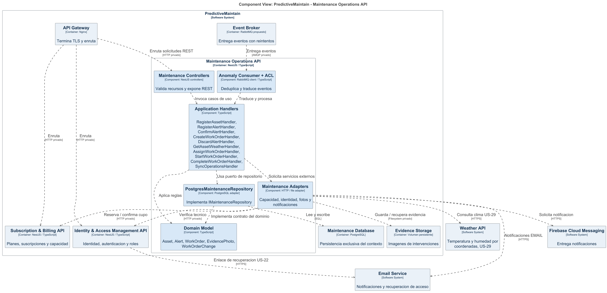

*Figura 5. Componentes de Maintenance Operations. Elaboración propia. Fuente: [Structurizr DSL](diagramas/workspace.dsl), vista maintenance-componentes.*

#### 2.6.2.6. Bounded Context Software Architecture Code Level Diagrams

Los modelos siguientes relacionan las clases de dominio con su representación persistente. La separación permite cambiar los adaptadores sin trasladar reglas de negocio a los controladores.

##### 2.6.2.6.1. Bounded Context Domain Layer Class Diagrams

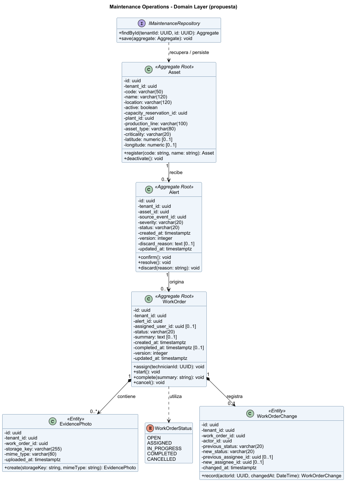

*Figura 6. Diagrama UML de dominio de Maintenance Operations. Elaboración propia. [Fuente PlantUML](diagramas/maintenance-clases.puml).*

Las relaciones del modelo son: Asset (1) → Alert (0..*), recibe; Alert (1) → WorkOrder (0..1), origina; WorkOrder (1) → EvidencePhoto (0..*), contiene; WorkOrder (1) → WorkOrderChange (0..*), registra. El signo «−» indica atributos privados y «+», operaciones públicas. Los value objects no requieren una tabla propia cuando sus valores se almacenan en la entidad propietaria.

##### 2.6.2.6.2. Bounded Context Database Design Diagram

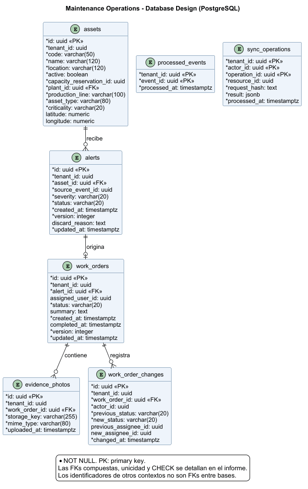

*Figura 7. Modelo relacional de Maintenance Operations. Elaboración propia. [Fuente editable](diagramas/maintenance-database.puml).*

**Diccionario de persistencia.** Cada clase persistente corresponde a la tabla siguiente. Las columnas y tipos son los documentados en Domain Layer y visibles en el diagrama. Los atributos opcionales permiten NULL.

| Clase | Tabla PostgreSQL |
| --- | --- |
| Asset | assets |
| Alert | alerts |
| WorkOrder | work_orders |
| EvidencePhoto | evidence_photos |
| WorkOrderChange | work_order_changes |

**Claves, restricciones e índices**

- assets: PK(id); UNIQUE(tenant_id, id); UNIQUE(tenant_id, code); UNIQUE(capacity_reservation_id).
- alerts: PK(id); UNIQUE(tenant_id, id); UNIQUE(tenant_id, source_event_id); FK(tenant_id, asset_id) a assets. CHECK(status IN (IN_REVIEW, CONFIRMED, DISCARDED, RESOLVED)); CHECK(version > 0).
- work_orders: PK(id); UNIQUE(tenant_id, id); UNIQUE(tenant_id, alert_id); FK(tenant_id, alert_id) a alerts. CHECK(status IN (OPEN, ASSIGNED, IN_PROGRESS, COMPLETED, CANCELLED)); CHECK(version > 0).
- En ASSIGNED, IN_PROGRESS y COMPLETED, assigned_user_id no puede ser NULL. En COMPLETED se exige summary no vacío y completed_at no nulo. Las fotografías son opcionales para cerrar; al adjuntarlas se validan formato y tamaño según TS-10.
- evidence_photos: PK(id); UNIQUE(storage_key); FK(tenant_id, work_order_id) a work_orders. Eliminación restringida mientras exista la orden.
- Índices: alerts(tenant_id, status, created_at) y work_orders(tenant_id, assigned_user_id, status). Los UUID de usuario y reserva son referencias externas sin FK entre bases.

**Tablas técnicas adicionales:** `processed_events(tenant_id UUID, event_id UUID, processed_at TIMESTAMPTZ)` con PK(tenant_id, event_id), y `sync_operations(tenant_id UUID, actor_id UUID, operation_id UUID, resource_id UUID, request_hash TEXT, result JSONB, processed_at TIMESTAMPTZ)` con PK(tenant_id, actor_id, operation_id). Todos sus campos son obligatorios. El registro técnico y el cambio de dominio se confirman juntos; reutilizar operationId con otro contenido devuelve conflicto. Estas tablas soportan reintentos y no representan agregados del negocio.

**Restricciones adicionales.** work_order_changes tiene PK(id) y FK(tenant_id, work_order_id) a work_orders; conserva actor, fecha y asignación anterior/nueva. En alerts, status=DISCARDED exige discard_reason no vacío. Las coordenadas deben estar ambas presentes o ambas ausentes, con latitude entre −90 y 90 y longitude entre −180 y 180.

**Extensiones de persistencia para los reportes y notificaciones.** `notification_preferences(id, tenant_id, plant_id, asset_type, recipient_user_id, channel)` y `notification_deliveries(id, tenant_id, alert_id, recipient_user_id, channel, status, attempted_at)` soportan US-06 y TS-08. `downtime_intervals(id, tenant_id, asset_id, started_at, ended_at)` registra paradas; `production_windows(id, tenant_id, asset_id, starts_at, ends_at, planned_seconds, operating_seconds, total_units, good_units, ideal_cycle_seconds)` aporta los datos de US-14–16, US-31 y TS-07/12. Todas tienen PK(id); las referencias locales a activos/alertas usan FK compuesta por tenant_id y el identificador. No se identifica «sin comunicación» con una parada física. El detalle de tipos y restricciones se incluye en el diagrama complementario de persistencia. `plants` identifica la planta y su responsable general; la referencia plant_id de assets y notification_preferences utiliza una FK local compuesta.

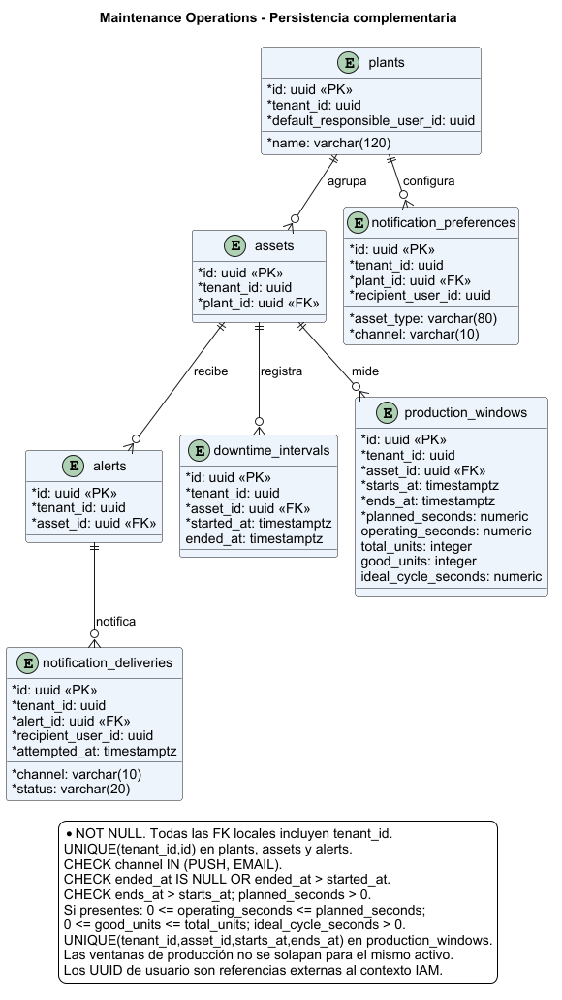

*Figura 7a. Persistencia complementaria de reportes y notificaciones. Elaboración propia. [Fuente editable](diagramas/maintenance-database-extension.puml).*

La disponibilidad se calcula sobre tiempo operativo y tiempo planificado; el OEE multiplica disponibilidad, rendimiento y calidad. Los intervalos de parada se recortan al periodo y se unen para evitar doble conteo. Con datos insuficientes se identifica el componente faltante. TS-07 pide 100 % cuando no hay eventos, mientras US-14 indica falta de información: debe resolverse esa discrepancia; se propone aplicar 100 % solo si hay cobertura de observación completa del periodo. Las exportaciones no contienen filas inventadas cuando no hay datos.

### 2.6.3. Bounded Context: Subscription & Billing

Controla empresas, planes y capacidad contratada. Conserva facturas internas de suscripción y no integra un cobro real en el alcance propuesto.

#### 2.6.3.1. Domain Layer

La capa de dominio define las siguientes clases. Los atributos se presentan con su tipo y finalidad; los métodos representan comportamiento del modelo, no operaciones CRUD genéricas.

**Company — Aggregate Root.** Cuenta corporativa que delimita la información del cliente.

| Atributo | Tipo | Descripción |
| --- | --- | --- |
| id | uuid | Identificador y tenantId |
| name | varchar(150) | Nombre de empresa |
| active | boolean | Habilitación de cuenta |

Métodos: `deactivate(): void`.

**SubscriptionPlan — Aggregate Root.** Oferta comercial con capacidad y precio.

| Atributo | Tipo | Descripción |
| --- | --- | --- |
| id | uuid | Identificador |
| name | varchar(60) | Basic, Pro o Enterprise |
| asset_limit | integer | Límite de activos |
| amount | numeric(12,2) | Precio por periodo |
| currency | char(3) | Moneda |

Métodos: `changeLimit(limit: int): void`.

**Subscription — Aggregate Root.** Condiciones contratadas por una empresa.

| Atributo | Tipo | Descripción |
| --- | --- | --- |
| id | uuid | Identificador |
| tenant_id | uuid | Empresa contratante |
| plan_id | uuid | Plan de referencia |
| asset_limit | integer | Límite contratado conservado |
| status | varchar(20) | ACTIVE, SUSPENDED o CANCELLED |
| starts_at | timestamptz | Inicio |
| ends_at | timestamptz | Fin |

Métodos: `isActive(at: DateTime): boolean`; `suspend(): void`; `cancel(): void`.

**CapacityReservation — Entity.** Cupo reservado o confirmado dentro de la suscripción.

| Atributo | Tipo | Descripción |
| --- | --- | --- |
| id | uuid | Identificador |
| tenant_id | uuid | Empresa |
| subscription_id | uuid | Suscripción |
| operation_id | uuid | Clave idempotente |
| asset_id | uuid | Activo externo previsto |
| status | varchar(20) | RESERVED, CONFIRMED o RELEASED |
| created_at | timestamptz | Fecha de reserva |

Métodos: `confirm(): void`; `release(): void`.

**Invoice — Aggregate Root.** Registro interno de facturación de la suscripción.

| Atributo | Tipo | Descripción |
| --- | --- | --- |
| id | uuid | Identificador |
| tenant_id | uuid | Empresa |
| subscription_id | uuid | Suscripción |
| number | varchar(50) | Número interno |
| amount | numeric(12,2) | Importe emitido |
| currency | char(3) | Moneda |
| status | varchar(20) | ISSUED, PAID o VOID |
| issued_at | timestamptz | Fecha de emisión |
| payment_reference | varchar(120)? | Referencia verificada, si existe |

Métodos: `markPaid(reference: string): void`; `void(): void`.

**Value objects y tipos de dominio**

| Tipo | Miembros | Propósito |
| --- | --- | --- |
| Money | amount: decimal; currency: string. of(amount, currency): Money | Importe no negativo y moneda de tres letras. Se persiste embebido en plan y factura. |

**Contrato de persistencia.** `IBillingRepository` representa los puertos de recuperación y persistencia del contexto: `findById(tenantId, id)` y `save(aggregate)`. El tipo Aggregate en el diagrama es una abreviatura de las raíces del contexto, no una tabla ni una clase adicional. En la implementación se separarán los repositorios por raíz cuando sus operaciones lo requieran.

**Reglas de negocio**

1. Una empresa tiene una suscripción vigente. El plan define precio, moneda y número máximo positivo de activos.
2. La vigencia requiere estado ACTIVE y un instante actual comprendido entre startsAt incluido y endsAt excluido.
3. La reserva de capacidad se serializa por suscripción. La suma de reservas RESERVED y CONFIRMED no puede superar el límite contratado.
4. Cada solicitud de reserva incluye una clave única por empresa. Un reintento devuelve la reserva previa; no consume dos cupos.
5. No se permite reducir el límite por debajo de la capacidad ocupada. Retirar un activo libera su reserva mediante una operación idempotente.
6. La factura conserva importe y moneda del momento de emisión. Solo pasa de ISSUED a PAID con una referencia externa verificada; emitirla no prueba un pago.
7. Los datos de tarjeta y CVV no se almacenan. Un proveedor de pagos, facturación fiscal e integración de cobro quedan fuera de esta versión del diseño.

#### 2.6.3.2. Interface Layer

Los controladores REST validan los recursos de entrada y delegan los casos de uso. Los permisos se verifican junto con la pertenencia del recurso a la empresa autenticada. Las rutas internas no son accesibles al cliente móvil.

| Endpoint propuesto | Recurso o contenido | Acceso |
| --- | --- | --- |
| GET /api/plans | PlanResource: name, assetLimit, amount, currency | Público, según US-25 |
| PUT /api/subscription/plan | ChangePlanResource: planId | MaintenanceManager |
| GET /api/subscription | SubscriptionResource: status, startsAt, endsAt, capacity | MaintenanceManager |
| POST /internal/capacity/reservations | ReserveCapacityResource: tenantId, operationId, assetId | Credencial servicio Maintenance |
| POST /internal/capacity/reservations/{id}/confirm | ConfirmReservationResource: assetId | Credencial servicio Maintenance |
| POST /internal/capacity/reservations/{id}/release | ReleaseReservationResource: reason | Credencial servicio Maintenance |
| GET /api/invoices | InvoiceResource: number, amount, currency, status | MaintenanceManager |

`BillingControllers` agrupa los controladores de estas rutas. Cada operación recibe el DTO indicado y devuelve un recurso explícito con identificador y estado. Las consultas de colecciones usan paginación.

#### 2.6.3.3. Application Layer

| Clase | Responsabilidad |
| --- | --- |
| RegisterCompanyHandler | Crea cuenta corporativa y suscripción inicial en coordinación con IAM. |
| ChangeSubscriptionPlanHandler | Actualiza capacidad; rechaza reducción inferior al consumo actual. |
| CheckSubscriptionExpiryHandler | Notifica a siete días del vencimiento y restringe monitoreo al vencer, según US-19. |
| CreateSubscriptionHandler | Valida empresa, plan y periodo. |
| ReserveCapacityHandler | Bloquea suscripción y reserva solo si hay cupo. |
| ConfirmCapacityHandler | Confirma reserva idempotentemente. |
| ReleaseCapacityHandler | Libera cupo sin borrar su trazabilidad. |
| IssueInvoiceHandler | Emite registro interno conservando precio y moneda. |

**Flujo principal.** CreateSubscriptionHandler valida empresa y plan. ReserveCapacityHandler bloquea la suscripción, revisa vigencia y cupos y registra CapacityReservation. Maintenance confirma la reserva después de persistir el activo. Las reservas pendientes se reconcilian consultando la existencia del activo antes de liberarlas; un timeout aislado no prueba que el alta haya fallado.

**Trazabilidad comercial.** US-17 permite aumentar el plan y prohíbe reducirlo por debajo del consumo. US-18 advierte a partir del 90 % del límite. US-19 notifica a siete días del vencimiento y restringe el monitoreo al caducar; esa política se consulta también desde telemetría. US-20 coordina una empresa nueva, su plan inicial y la identidad del jefe. No constituye evidencia de una cuenta o suscripción ya creada.

#### 2.6.3.4. Infrastructure Layer

PostgresBillingRepository implementa persistencia y bloqueo transaccional de capacidad; CapacityReconciliationJob resuelve reservas pendientes con Maintenance. RegisterCompanyHandler coordina el alta de empresa y plan inicial solicitada por US-20. El alta se conserva como pendiente hasta crear la primera identidad; los reintentos reutilizan el mismo registrationId para evitar empresas duplicadas. No existe un PaymentGatewayAdapter implementado ni un proveedor contratado.

Los adaptadores implementan los contratos requeridos por Application y Domain. Los repositorios aplican filtros por empresa y la transacción abarca las modificaciones que deben confirmarse juntas. Un error de persistencia no se traduce en una operación completada.

#### 2.6.3.5. Bounded Context Software Architecture Component Level Diagrams

El contenedor Subscription & Billing API se descompone en controladores, handlers, modelo de dominio y adaptadores de infraestructura. Los controladores llaman a los handlers; estos coordinan las reglas y utilizan contratos de persistencia. Los adaptadores conocen PostgreSQL, mientras el modelo de dominio permanece independiente.

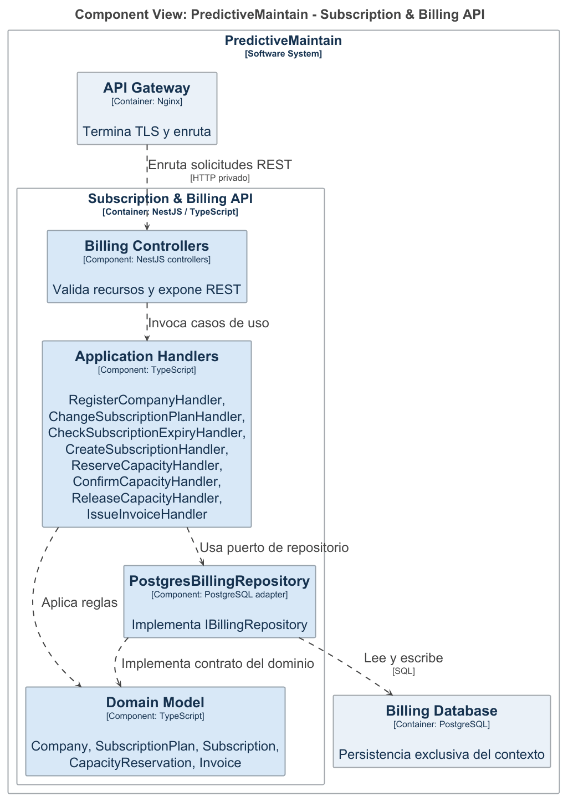

*Figura 8. Componentes de Subscription & Billing. Elaboración propia. Fuente: [Structurizr DSL](diagramas/workspace.dsl), vista billing-componentes.*

#### 2.6.3.6. Bounded Context Software Architecture Code Level Diagrams

Los modelos siguientes relacionan las clases de dominio con su representación persistente. La separación permite cambiar los adaptadores sin trasladar reglas de negocio a los controladores.

##### 2.6.3.6.1. Bounded Context Domain Layer Class Diagrams

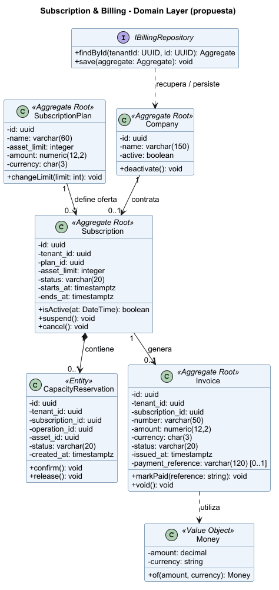

*Figura 9. Diagrama UML de dominio de Subscription & Billing. Elaboración propia. [Fuente PlantUML](diagramas/billing-clases.puml).*

Las relaciones del modelo son: Company (1) → Subscription (0..1), contrata; SubscriptionPlan (1) → Subscription (0..*), define oferta; Subscription (1) → CapacityReservation (0..*), contiene; Subscription (1) → Invoice (0..*), genera. El signo «−» indica atributos privados y «+», operaciones públicas. Los value objects no requieren una tabla propia cuando sus valores se almacenan en la entidad propietaria.

##### 2.6.3.6.2. Bounded Context Database Design Diagram

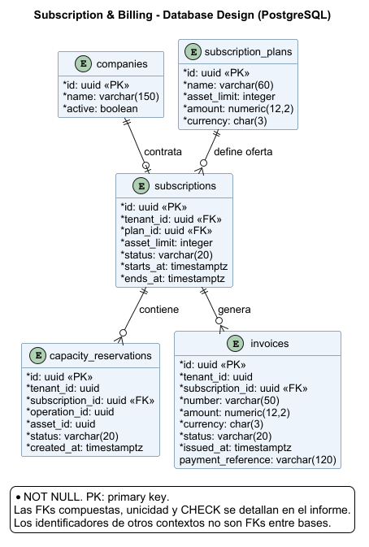

*Figura 10. Modelo relacional de Subscription & Billing. Elaboración propia. [Fuente editable](diagramas/billing-database.puml).*

**Diccionario de persistencia.** Cada clase persistente corresponde a la tabla siguiente. Las columnas y tipos son los documentados en Domain Layer y visibles en el diagrama. Los atributos opcionales permiten NULL.

| Clase | Tabla PostgreSQL |
| --- | --- |
| Company | companies |
| SubscriptionPlan | subscription_plans |
| Subscription | subscriptions |
| CapacityReservation | capacity_reservations |
| Invoice | invoices |

**Claves, restricciones e índices**

- companies: PK(id). subscription_plans: PK(id); UNIQUE(name); CHECK(asset_limit > 0); CHECK(amount >= 0).
- subscriptions: PK(id); UNIQUE(tenant_id); UNIQUE(tenant_id, id); FK(tenant_id) a companies(id); FK(plan_id) a subscription_plans(id); CHECK(ends_at > starts_at); CHECK(asset_limit > 0).
- La propuesta inicial conserva una suscripción por empresa y permite renovar su periodo; no modela múltiples contratos simultáneos. El historial comercial queda en las facturas.
- capacity_reservations: PK(id); UNIQUE(tenant_id, operation_id); FK(tenant_id, subscription_id) a subscriptions; índice único parcial (tenant_id, asset_id) WHERE status IN (RESERVED, CONFIRMED).
- El límite agregado no se implementa con un CHECK de fila: ReserveCapacityHandler bloquea subscriptions, cuenta reservas vigentes y registra el cupo en una transacción.
- invoices: PK(id); UNIQUE(tenant_id, number); FK(tenant_id, subscription_id) a subscriptions; CHECK(amount >= 0); CHECK(status IN (ISSUED, PAID, VOID)). PAID requiere payment_reference no vacío.

### 2.6.4. Bounded Context: Identity & Access Management

Gestiona identidades y permisos de acceso de jefes de mantenimiento, técnicos y operadores. Publica un contrato de identidad común para los demás contextos.

#### 2.6.4.1. Domain Layer

La capa de dominio define las siguientes clases. Los atributos se presentan con su tipo y finalidad; los métodos representan comportamiento del modelo, no operaciones CRUD genéricas.

**UserAccount — Aggregate Root.** Identidad de una persona dentro de una cuenta corporativa.

| Atributo | Tipo | Descripción |
| --- | --- | --- |
| id | uuid | Identificador |
| tenant_id | uuid | Referencia externa a Company |
| email | varchar(254) | Correo normalizado |
| display_name | varchar(120) | Nombre visible |
| password_hash | text | Hash de credencial |
| active | boolean | Estado de cuenta |
| created_at | timestamptz | Fecha de creación |

Métodos: `deactivate(): void`; `changePassword(hash: string): void`; `assignRole(role: Role): void`; `removeRole(role: Role): void`.

**Role — Entity.** Permiso funcional agrupado por perfil.

| Atributo | Tipo | Descripción |
| --- | --- | --- |
| id | uuid | Identificador |
| name | varchar(40) | MaintenanceManager, Technician u Operator |

Métodos: `allows(action: string): boolean`.

**UserRole — Entity.** Asignación de un rol a una identidad.

| Atributo | Tipo | Descripción |
| --- | --- | --- |
| id | uuid | Identificador |
| tenant_id | uuid | Empresa |
| user_id | uuid | Cuenta |
| role_id | uuid | Rol asignado |

Métodos: `create(userId: UUID, roleId: UUID): UserRole`.

**PasswordResetRequest — Aggregate Root.** Solicitud temporal de recuperación de contraseña correspondiente a US-22.

| Atributo | Tipo | Descripción |
| --- | --- | --- |
| id | uuid | Identificador |
| tenant_id | uuid | Empresa |
| user_id | uuid | Usuario solicitante |
| token_hash | text | Hash del token enviado por correo |
| expires_at | timestamptz | Caducidad |
| used_at | timestamptz? | Instante de uso |

Métodos: `isValid(at: DateTime): boolean`; `consume(at: DateTime): void`.

**Value objects y tipos de dominio**

| Tipo | Miembros | Propósito |
| --- | --- | --- |
| EmailAddress | value: string. normalize(value): EmailAddress | Valida formato básico y normaliza espacios y mayúsculas antes de comprobar unicidad. |

**Contrato de persistencia.** `IIamRepository` representa los puertos de recuperación y persistencia del contexto: `findById(tenantId, id)` y `save(aggregate)`. El tipo Aggregate en el diagrama es una abreviatura de las raíces del contexto, no una tabla ni una clase adicional. En la implementación se separarán los repositorios por raíz cuando sus operaciones lo requieran.

**Reglas de negocio**

1. El correo normalizado es único en la plataforma conforme a US-20 y TS-03. La cuenta conserva tenantId para delimitar los datos empresariales.
2. La contraseña se conserva únicamente como hash. Los recursos de salida no exponen el hash ni las credenciales.
3. Una cuenta desactivada no puede iniciar sesión ni ejecutar operaciones. La verificación de cuenta activa se realiza al autorizar las solicitudes protegidas.
4. Los roles propuestos son MaintenanceManager, Technician y Operator. El rol Operator completa el segmento de operadores que ya figura en el capítulo I.
5. El tenantId de una operación de usuario se obtiene de la identidad validada; nunca se acepta como autoridad un tenantId enviado libremente en el cuerpo.
6. Solo un MaintenanceManager puede invitar usuarios o cambiar roles dentro de su empresa. US-20 permite el registro público de una nueva empresa y su primer jefe. El servidor asigna ese rol exclusivamente a la empresa recién creada; el cliente no puede elegir una empresa existente ni otorgarse privilegios en ella.

#### 2.6.4.2. Interface Layer

Los controladores REST validan los recursos de entrada y delegan los casos de uso. Los permisos se verifican junto con la pertenencia del recurso a la empresa autenticada. Las rutas internas no son accesibles al cliente móvil.

| Endpoint propuesto | Recurso o contenido | Acceso |
| --- | --- | --- |
| POST /api/auth/register | RegisterCompanyResource: companyName, email, password, registrationId | Público; crea una empresa nueva |
| POST /api/auth/password-reset-requests | PasswordResetRequestResource: email | Público |
| POST /api/auth/password-reset | ResetPasswordResource: token, newPassword | Token temporal válido |
| PATCH /api/users/me | UpdateProfileResource: displayName | Usuario autenticado |
| POST /api/auth/login | LoginResource: email, password | Público; validación de credenciales |
| GET /api/users/me | UserResource: id, displayName, roles | Usuario autenticado |
| POST /api/users | CreateUserResource: email, displayName, initialPassword, roles | MaintenanceManager |
| PUT /api/users/{id}/roles | ChangeRolesResource: roles | MaintenanceManager |
| POST /api/users/{id}/deactivate | DeactivateUserResource | MaintenanceManager |
| GET /internal/users/{id}/status | UserStatusResource: tenantId, active, roles | Credencial de servicio |

`IamControllers` agrupa los controladores de estas rutas. Cada operación recibe el DTO indicado y devuelve un recurso explícito con identificador y estado. Las consultas de colecciones usan paginación.

#### 2.6.4.3. Application Layer

| Clase | Responsabilidad |
| --- | --- |
| RegisterCompanyAccountHandler | Coordina empresa, plan inicial y primera identidad con idempotencia. |
| RequestPasswordResetHandler | Genera solicitud temporal y envía el enlace por correo. |
| ResetPasswordHandler | Verifica vigencia y uso del token, cambia el hash e invalida la solicitud. |
| UpdateProfileHandler | Actualiza nombre y datos de contacto válidos (US-23). |
| LoginHandler | Valida credenciales y emite identidad autenticada. |
| CreateUserHandler | Verifica permiso del jefe, correo único y roles permitidos. |
| ChangeRolesHandler | Cambia asignaciones dentro de la empresa. |
| DeactivateUserHandler | Desactiva cuenta y deniega nuevas operaciones. |
| GetUserStatusHandler | Expone solo estado y roles a servicios autenticados. |

**Flujo principal.** LoginHandler busca el usuario por correo normalizado, comprueba estado y verifica el hash mediante PasswordHasher. TokenIssuer emite un JWT con sub, tenantId, roles y expiración. En cada API, JwtAuthorizationGuard valida token y permisos y consulta el estado de la cuenta; las operaciones sobre recursos verifican además empresa y propiedad.

#### 2.6.4.4. Infrastructure Layer

PostgresIdentityRepository implementa usuarios y roles; PasswordHashAdapter calcula y verifica hashes con una biblioteca mantenida; JwtTokenAdapter firma tokens. PasswordResetEmailAdapter entrega el enlace de US-22. El token de recuperación es de un solo uso y solo su hash se persiste. Las claves se suministran mediante configuración de secretos y no se incluyen en el informe ni en el repositorio. La selección y parametrización de la biblioteca de hashing se realizará al implementar.

Los adaptadores implementan los contratos requeridos por Application y Domain. Los repositorios aplican filtros por empresa y la transacción abarca las modificaciones que deben confirmarse juntas. Un error de persistencia no se traduce en una operación completada.

#### 2.6.4.5. Bounded Context Software Architecture Component Level Diagrams

El contenedor Identity & Access Management API se descompone en controladores, handlers, modelo de dominio y adaptadores de infraestructura. Los controladores llaman a los handlers; estos coordinan las reglas y utilizan contratos de persistencia. Los adaptadores conocen PostgreSQL, mientras el modelo de dominio permanece independiente.

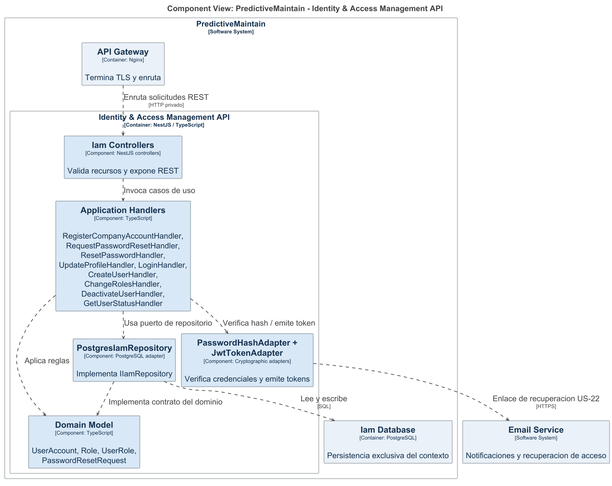

*Figura 11. Componentes de Identity & Access Management. Elaboración propia. Fuente: [Structurizr DSL](diagramas/workspace.dsl), vista iam-componentes.*

#### 2.6.4.6. Bounded Context Software Architecture Code Level Diagrams

Los modelos siguientes relacionan las clases de dominio con su representación persistente. La separación permite cambiar los adaptadores sin trasladar reglas de negocio a los controladores.

##### 2.6.4.6.1. Bounded Context Domain Layer Class Diagrams

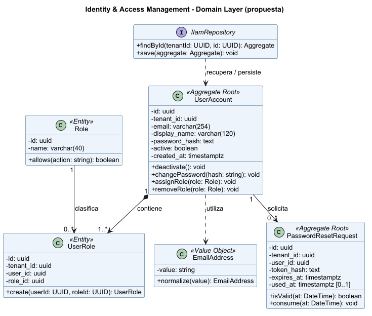

*Figura 12. Diagrama UML de dominio de Identity & Access Management. Elaboración propia. [Fuente PlantUML](diagramas/iam-clases.puml).*

Las relaciones del modelo son: UserAccount (1) → UserRole (1..*), contiene; Role (1) → UserRole (0..*), clasifica; UserAccount (1) → PasswordResetRequest (0..*), solicita. El signo «−» indica atributos privados y «+», operaciones públicas. Los value objects no requieren una tabla propia cuando sus valores se almacenan en la entidad propietaria.

##### 2.6.4.6.2. Bounded Context Database Design Diagram

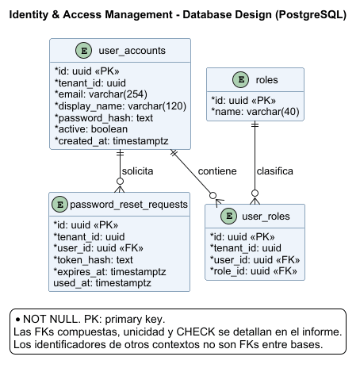

*Figura 13. Modelo relacional de Identity & Access Management. Elaboración propia. [Fuente editable](diagramas/iam-database.puml).*

**Diccionario de persistencia.** Cada clase persistente corresponde a la tabla siguiente. Las columnas y tipos son los documentados en Domain Layer y visibles en el diagrama. Los atributos opcionales permiten NULL.

| Clase | Tabla PostgreSQL |
| --- | --- |
| UserAccount | user_accounts |
| Role | roles |
| UserRole | user_roles |
| PasswordResetRequest | password_reset_requests |

**Claves, restricciones e índices**

- user_accounts: PK(id); UNIQUE(tenant_id, id); UNIQUE(email). tenant_id es una referencia externa a Company, validada en el aprovisionamiento.
- roles: PK(id); UNIQUE(name); CHECK(name IN (MaintenanceManager, Technician, Operator)).
- user_roles: PK(id); UNIQUE(tenant_id, user_id, role_id); FK(tenant_id, user_id) a user_accounts; FK(role_id) a roles.
- Un usuario debe conservar al menos un rol. Esta cardinalidad mínima se valida al crear o modificar el agregado en una transacción.
- No se persiste un JWT como atributo del usuario. El hash solo se almacena en user_accounts y se excluye de DTOs de salida y registros de diagnóstico.

**Recuperación de contraseña.** password_reset_requests tiene PK(id), UNIQUE(token_hash) y FK(tenant_id, user_id) a user_accounts. Un token caducado o usado se rechaza; consume() y el cambio de password_hash se confirman juntos. El correo incluye el token original, pero la base solo conserva su hash. US-22 plantea indicar que un correo no existe; la respuesta pública y sus implicaciones de privacidad deben acordarse con el equipo antes de implementar.

<!-- Fin del alcance solicitado: 2.6.4.6.2. -->

# Capítulo III: Solution UI/UX Design

## 3.1. Product design

### 3.1.1. Style Guidelines

#### 3.1.1.1. General Style Guidelines

### 3.1.2. Information Architecture

#### 3.1.2.1. Organization Systems

#### 3.1.2.2. Labelling Systems

#### 3.1.2.3. SEO Tags and Meta Tags

#### 3.1.2.4. Searching Systems

#### 3.1.2.5. Navigation Systems

### 3.1.3. Landing Page UI Design

#### 3.1.3.1. Landing Page Wireframe

#### 3.1.3.2. Landing Page Mock-up

### 3.1.4. Mobile Applications UX/UI Design

#### 3.1.4.1. Mobile Applications Wireframes

#### 3.1.4.2. Mobile Applications Wireflow Diagrams

#### 3.1.4.3. Mobile Applications Mock-ups

#### 3.1.4.4. Mobile Applications User Flow Diagrams

#### 3.1.4.5. Mobile Applications Prototyping

# Capítulo IV: Product Implementation & Validation

## 4.1. Software Configuration Management

### 4.1.1. Software Development Environment Configuration

### 4.1.2. Source Code Management

### 4.1.3. Source Code Style Guide & Conventions

### 4.1.4. Software Deployment Configuration

## 4.2. Landing Page & Mobile Application Implementation

### 4.2.1. Sprint n

#### 4.2.1.1. Sprint Planning n

#### 4.2.1.2. Aspect Leaders and Collaborators

#### 4.2.1.3. Sprint Backlog n

#### 4.2.1.4. Development Evidence for Sprint Review

#### 4.2.1.5. Testing Suite Evidence for Sprint Review

#### 4.2.1.6. Execution Evidence for Sprint Review

#### 4.2.1.7. Services Documentation Evidence for Sprint Review

#### 4.2.1.8. Software Deployment Evidence for Sprint Review

#### 4.2.1.9. Team Collaboration Insights during Sprint

## 4.3. Validation Interviews

### 4.3.1. Diseño de Entrevistas

### 4.3.2. Registro de Entrevistas

### 4.3.3. Evaluaciones según heurísticas

# Conclusiones

# Conclusiones y recomendaciones

# Video App Validation

# Video About the product

# Video About the team

# Glosario

# Bibliografía

# Anexos
